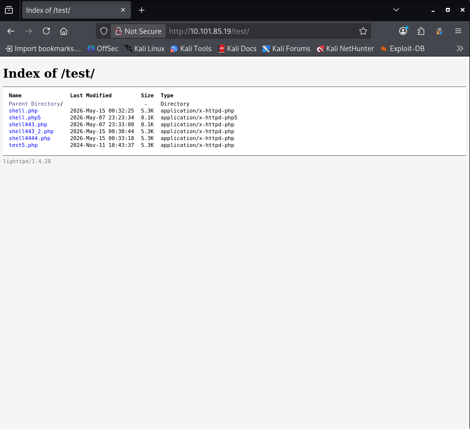

# OSCP Vulnhub Set 1 - SickOs 1.2

Lab link: http://ccmtlab.ccmt.home.arpa:8888/user/missions/boxes?uuid=0ad5b29e-cd00-49b7-b0be-12f628d55d20

Target IP: 10.101.85.19

---

## Scanning and Enumeration

### Nmap

Scan all popular ports with OS, version, and script detection.

```
nmap -Pn -A 10.101.85.19
```

The scan reveals that SSH and HTTP ports are open.

```
┌──(kali㉿kali)-[~/Desktop/ccmtlab/09]
└─$ nmap -Pn -A 10.101.85.19
Starting Nmap 7.99 ( https://nmap.org ) at 2026-05-27 22:33 -0400
Nmap scan report for 10.101.85.19
Host is up (0.0034s latency).
Not shown: 998 filtered tcp ports (no-response)
PORT   STATE SERVICE VERSION
22/tcp open  ssh     OpenSSH 5.9p1 Debian 5ubuntu1.8 (Ubuntu Linux; protocol 2.0)
| ssh-hostkey: 
|   1024 66:8c:c0:f2:85:7c:6c:c0:f6:ab:7d:48:04:81:c2:d4 (DSA)
|   2048 ba:86:f5:ee:cc:83:df:a6:3f:fd:c1:34:bb:7e:62:ab (RSA)
|_  256 a1:6c:fa:18:da:57:1d:33:2c:52:e4:ec:97:e2:9e:af (ECDSA)
80/tcp open  http    lighttpd 1.4.28
|_http-title: Site doesn't have a title (text/html).
|_http-server-header: lighttpd/1.4.28
Warning: OSScan results may be unreliable because we could not find at least 1 open and 1 closed port
Device type: general purpose|media device|router
Running (JUST GUESSING): Linux 3.X|4.X (92%), Google Android 11 (85%), Cisco embedded (85%)
OS CPE: cpe:/o:linux:linux_kernel:3 cpe:/o:linux:linux_kernel:4 cpe:/o:google:android:11 cpe:/o:linux:linux_kernel:4.9 cpe:/o:linux:linux_kernel cpe:/h:cisco:rv320
Aggressive OS guesses: Linux 3.11 - 4.9 (92%), Linux 3.13 (90%), Linux 3.10 - 3.16 (87%), Linux 3.10 - 4.11 (85%), Linux 3.13 - 4.4 (85%), Linux 3.16 - 4.6 (85%), Linux 3.2 - 4.14 (85%), Linux 3.8 - 3.16 (85%), Linux 4.0 - 4.4 (85%), Linux 4.4 (85%)
No exact OS matches for host (test conditions non-ideal).
Network Distance: 2 hops
Service Info: OS: Linux; CPE: cpe:/o:linux:linux_kernel

TRACEROUTE (using port 22/tcp)
HOP RTT     ADDRESS
1   3.98 ms 10.101.55.1
2   4.05 ms 10.101.85.19

OS and Service detection performed. Please report any incorrect results at https://nmap.org/submit/ .
Nmap done: 1 IP address (1 host up) scanned in 23.87 seconds
```

Navigate to the web application in a browser.

```
http://10.101.85.19/
```

The home page displays a default image with no significant information.


---

### Dirb

Run directory brute-forcing to discover hidden directories.

```
dirb http://10.101.85.19/
```

The tool identifies a listable directory named test.

```
┌──(kali㉿kali)-[~/Desktop/ccmtlab/09]
└─$ dirb http://10.101.85.19/                   

-----------------
DIRB v2.22    
By The Dark Raver
-----------------

START_TIME: Wed May 27 22:37:15 2026
URL_BASE: http://10.101.85.19/
WORDLIST_FILES: /usr/share/dirb/wordlists/common.txt

-----------------

GENERATED WORDS: 4612                                                          

---- Scanning URL: http://10.101.85.19/ ----
+ http://10.101.85.19/index.php (CODE:200|SIZE:163)                                                               
==> DIRECTORY: http://10.101.85.19/test/                                                                          
                                                                                                                  
---- Entering directory: http://10.101.85.19/test/ ----
(!) WARNING: Directory IS LISTABLE. No need to scan it.                        
    (Use mode '-w' if you want to scan it anyway)
                                                                               
-----------------
END_TIME: Wed May 27 22:37:26 2026
DOWNLOADED: 4612 - FOUND: 1
```

Access the directory to verify its contents.

```
http://10.101.85.19/test/
```

The directory index is empty and contains no visible files.



Send an OPTIONS request to check the supported HTTP methods on this path.

```
curl --head -X OPTIONS 10.101.85.19/test/
```

The response indicates that WebDAV is enabled and arbitrary file upload is allowed via the PUT method.

```
┌──(kali㉿kali)-[~/Desktop/ccmtlab/09]
└─$ curl --head -X OPTIONS 10.101.85.19/test/
HTTP/1.1 200 OK
DAV: 1,2
MS-Author-Via: DAV
Allow: PROPFIND, DELETE, MKCOL, PUT, MOVE, COPY, PROPPATCH, LOCK, UNLOCK
Allow: OPTIONS, GET, HEAD, POST
Content-Length: 0
Date: Thu, 28 May 2026 02:54:14 GMT
Server: lighttpd/1.4.28
```