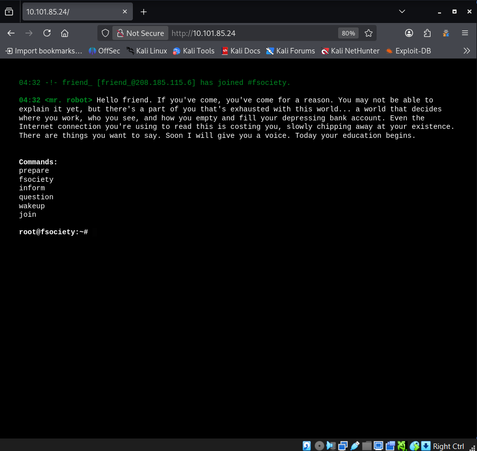

# OSCP Vulnhub Set 1 - Mr-Robot 1

Lab link: http://ccmtlab.ccmt.home.arpa:8888/user/missions/boxes?uuid=2b25523c-ff87-461a-96a6-bb13b833098e

Target IP: 10.101.85.24

---

## Scanning and Enumeration

### Nmap

Scan all popular ports with OS, version, and script detection.

```
nmap -Pn -A 10.101.85.24
```

เจอ http

```
┌──(kali㉿kali)-[~/Desktop/ccmtlab/11]
└─$ nmap -Pn -A 10.101.85.24
Starting Nmap 7.99 ( https://nmap.org ) at 2026-05-28 03:57 -0400
Nmap scan report for 10.101.85.24
Host is up (0.022s latency).
Not shown: 997 filtered tcp ports (no-response)
PORT    STATE  SERVICE  VERSION
22/tcp  closed ssh
80/tcp  open   http     Apache httpd
|_http-server-header: Apache
|_http-title: Site doesn't have a title (text/html).
443/tcp open   ssl/http Apache httpd
| ssl-cert: Subject: commonName=www.example.com
| Not valid before: 2015-09-16T10:45:03
|_Not valid after:  2025-09-13T10:45:03
|_ssl-date: TLS randomness does not represent time
|_http-server-header: Apache
|_http-title: Site doesn't have a title (text/html).
Device type: general purpose|media device|router
Running (JUST GUESSING): Linux 3.X|4.X|2.6.X (97%), Google Android 11 (92%), Cisco embedded (90%)
OS CPE: cpe:/o:linux:linux_kernel:3 cpe:/o:linux:linux_kernel:4 cpe:/o:google:android:11 cpe:/o:linux:linux_kernel:4.9 cpe:/o:linux:linux_kernel:2.6.32 cpe:/o:linux:linux_kernel cpe:/h:cisco:rv320
Aggressive OS guesses: Linux 3.11 - 4.9 (97%), Linux 3.13 (94%), Linux 4.0 - 4.4 (92%), Linux 4.4 (92%), Nvidia Shield TV (Android 11, Linux 4.9) (92%), Linux 2.6.32 (92%), Linux 3.2 - 3.8 (92%), Cisco RV320 router (90%), Linux 2.6.32 - 2.6.39 (90%), Linux 2.6.32 - 3.0 (88%)
No exact OS matches for host (test conditions non-ideal).
Network Distance: 2 hops

TRACEROUTE (using port 22/tcp)
HOP RTT      ADDRESS
1   27.07 ms 10.101.55.1
2   27.28 ms 10.101.85.24

OS and Service detection performed. Please report any incorrect results at https://nmap.org/submit/ .
Nmap done: 1 IP address (1 host up) scanned in 32.73 seconds
```

dir search

```
gobuster dir -u http://10.101.85.24/ -w /usr/share/dirb/wordlists/common.txt -t 20 -b "400,403,404,500"
```

เจอหลาย dir เลย แล้วเหมือนจะใช้ wp ด้วย

```
┌──(kali㉿kali)-[~/Desktop/ccmtlab/11]
└─$ gobuster dir -u http://10.101.85.24/ -w /usr/share/dirb/wordlists/common.txt -t 20 -b "400,403,404,500"
===============================================================
Gobuster v3.8.2
by OJ Reeves (@TheColonial) & Christian Mehlmauer (@firefart)
===============================================================
[+] Url:                     http://10.101.85.24/
[+] Method:                  GET
[+] Threads:                 20
[+] Wordlist:                /usr/share/dirb/wordlists/common.txt
[+] Negative Status codes:   400,403,404,500
[+] User Agent:              gobuster/3.8.2
[+] Timeout:                 10s
===============================================================
Starting gobuster in directory enumeration mode
===============================================================
admin                (Status: 301) [Size: 234] [--> http://10.101.85.24/admin/]
audio                (Status: 301) [Size: 234] [--> http://10.101.85.24/audio/]
blog                 (Status: 301) [Size: 233] [--> http://10.101.85.24/blog/]
css                  (Status: 301) [Size: 232] [--> http://10.101.85.24/css/]
favicon.ico          (Status: 200) [Size: 0]
images               (Status: 301) [Size: 235] [--> http://10.101.85.24/images/]
index.html           (Status: 200) [Size: 1188]
js                   (Status: 301) [Size: 231] [--> http://10.101.85.24/js/]
license              (Status: 200) [Size: 309]
readme               (Status: 200) [Size: 64]
robots.txt           (Status: 200) [Size: 47]
robots               (Status: 200) [Size: 47]
sitemap.xml          (Status: 200) [Size: 0]
sitemap              (Status: 200) [Size: 0]
video                (Status: 301) [Size: 234] [--> http://10.101.85.24/video/]
intro                (Status: 200) [Size: 516314]
wp-admin             (Status: 301) [Size: 237] [--> http://10.101.85.24/wp-admin/]
wp-content           (Status: 301) [Size: 239] [--> http://10.101.85.24/wp-content/]
wp-includes          (Status: 301) [Size: 240] [--> http://10.101.85.24/wp-includes/]
Progress: 4613 / 4613 (100.00%)
===============================================================
Finished
===============================================================
```

Browsing to the HTTP sites.

```
http://10.101.85.24/
```

Found a Mr Robot terminal themed website. 



ลองเปิด robots.txt

```
http://10.101.85.24/robots.txt
```

เจอ hidden file

```
User-agent: *
fsocity.dic
firstflag-1-of-3.txt
```

โหลด fsocity.dic เข้า kali

```
wget http://10.101.85.24/fsocity.dic
```

เหมือนจะเป็น wordlist นะ

```
┌──(kali㉿kali)-[~/Desktop/ccmtlab/11]
└─$ head fsocity.dic 
true
false
wikia
from
the
now
Wikia
extensions
scss
window
```

ตัดคำซ้ำออก

```
sort -u fsocity.dic > fsocity_clean.txt
```

